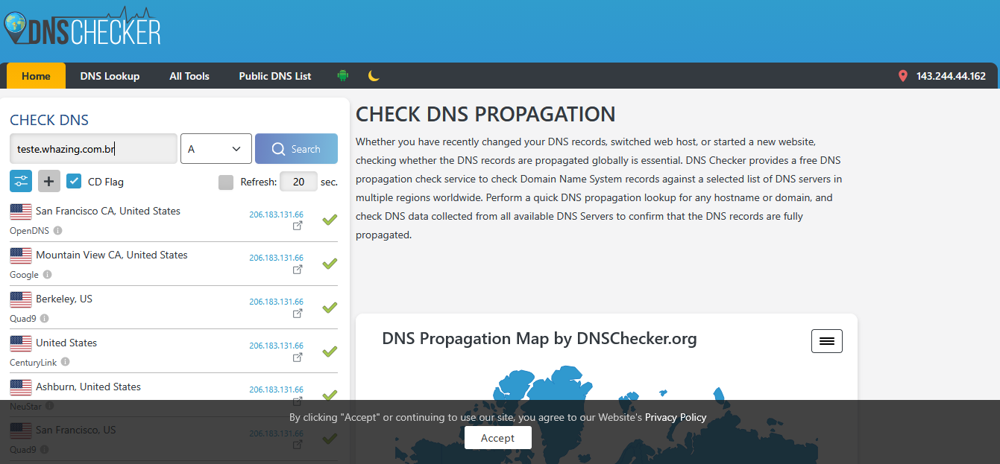
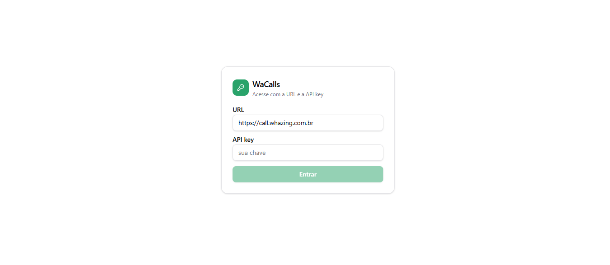
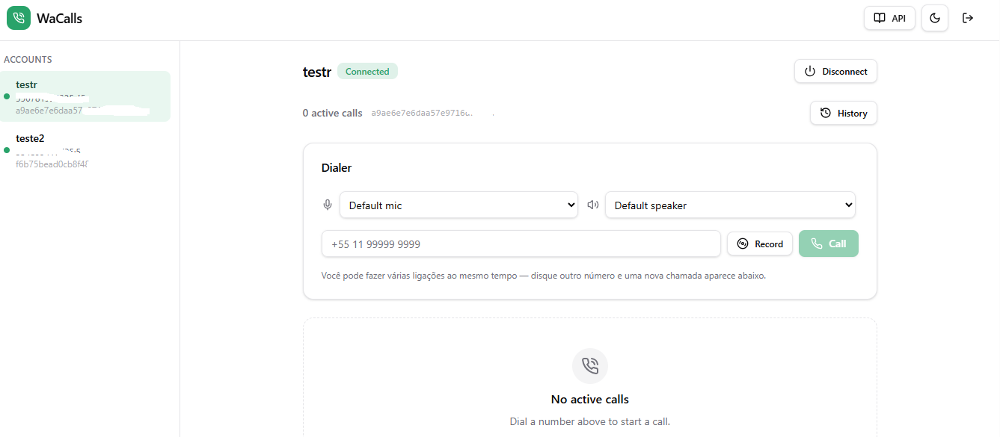
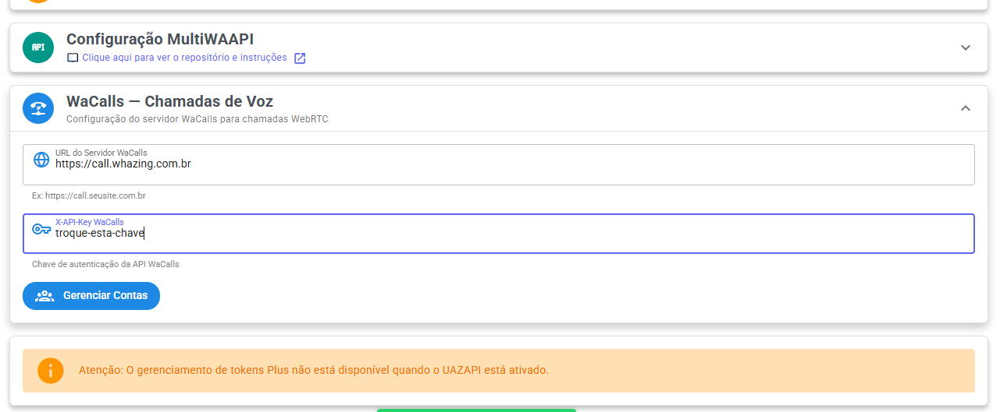
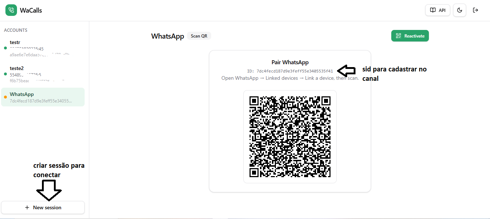
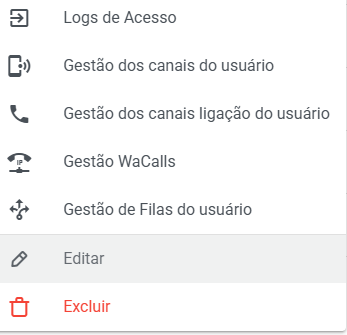

# WaCalls

### O que é o WaCalls?

O WaCalls é um serviço responsável pelas chamadas de voz do WhatsApp integrado ao Whazing.

Com ele você poderá:

* Receber chamadas de voz do WhatsApp.
* Realizar chamadas diretamente pela tela de atendimento.
* Direcionar chamadas automaticamente para os atendentes.
* Utilizar múltiplas conexões (SID) para aumentar a disponibilidade das chamadas.

***

## ⚠️ Avisos Importantes

> **Este é um recurso novo e experimental.**

Antes de utilizar em produção, leia atentamente as informações abaixo.

* O consumo de CPU, memória e rede pode variar conforme a quantidade de chamadas simultâneas.
* Ainda não é possível garantir estabilidade em todos os ambientes.
* A Meta pode alterar o funcionamento das chamadas do WhatsApp a qualquer momento.
* Dependendo da quantidade de chamadas simultâneas, pode ser recomendado utilizar uma VPS dedicada exclusivamente ao WaCalls.

### Utilizamos uma versão modificada

Neste tutorial utilizaremos uma **versão modificada do WaCalls**.

A versão original disponível no GitHub **não possui autenticação na API**, o que torna sua instalação insegura quando publicada em uma VPS com acesso à internet.

Nossa versão adiciona autenticação por API Key, protegendo o acesso ao serviço.

***

## Pré-requisitos

Antes de iniciar, sua VPS deve possuir:

* Docker instalado.
* Proxy reverso (Caddy ou Nginx).
* Domínio público apontando para a VPS.
* Portas TCP e UDP liberadas.

> **Se você já possui o Whazing instalado, normalmente já possui Docker, Caddy e HTTPS configurados.**

***

## Não quer fazer a instalação?

Caso não tenha experiência com Linux, Docker ou configuração de servidores, nossa equipe pode realizar toda a instalação para você.

O serviço inclui:

* Instalação completa do WaCalls.
* Configuração do Docker.
* Configuração do Caddy.
* Configuração do HTTPS.
* Liberação das portas necessárias.
* Testes de funcionamento.
* Integração com o Whazing.

**Contratar serviço de instalação:**

[https://gestor.whazing.com.br/products/client/detail/14](https://gestor.whazing.com.br/products/client/detail/14)

***

## Configurando o domínio

Crie um subdomínio apontando para sua VPS.

Exemplo:

```
call.seudominio.com.br
```

Após criar o registro DNS, aguarde a propagação.

Você pode verificar utilizando:

[https://dnschecker.org](https://dnschecker.org)

> **Importante:** somente continue quando o domínio estiver propagado corretamente.

<figure><figcaption></figcaption></figure>

***

## Instalando o WaCalls

Execute o comando abaixo:

```bash
docker run -d \
--name wacalls \
-p 8082:8080/tcp \
-p 5000:5000/tcp \
-p 5000:5000/udp \
-e WACALLS_PUBLIC_IP=auto \
-e WACALLS_UDP_PORT=5000 \
-e WACALLS_MAX_CALLS=1 \
-e WACALLS_API_KEY=troque-esta-chave \
-v wacalls-data:/data \
--restart unless-stopped \
whazing/wacalls:latest
```

Após criar o container, conecte-o também na rede **bridge**:

```bash
docker network connect bridge wacalls || true
```

***

## Configurando as variáveis

### WACALLS\_PUBLIC\_IP

```
auto
```

O WaCalls tentará detectar automaticamente o IP público da VPS.

Caso a detecção automática não funcione, informe manualmente o IP público.

Exemplo:

```
WACALLS_PUBLIC_IP=123.123.123.123
```

***

### WACALLS\_UDP\_PORT

Porta utilizada para transmissão do áudio.

Neste tutorial utilizaremos:

```
5000
```

Essa porta **deve estar aberta tanto em TCP quanto em UDP**.

Caso contrário, a chamada poderá conectar normalmente, porém ficará **sem áudio**.

Caso utilize UFW, execute:

```bash
sudo ufw allow 5000/tcp
sudo ufw allow 5000/udp
sudo ufw reload
```

***

### WACALLS\_MAX\_CALLS

Quantidade máxima de chamadas simultâneas permitidas por QR Code.

Recomendamos manter:

```
1
```

Esse é o comportamento mais próximo ao funcionamento original do WhatsApp.

Caso necessite mais chamadas simultâneas, recomendamos conectar o mesmo número mais de uma vez, gerando múltiplos QR Codes e múltiplos SIDs.

***

### WACALLS\_API\_KEY

Token utilizado para proteger sua instalação.

Escolha uma chave segura.

Exemplo:

```
9ecf26d4db9d7d8e86c44ef8e...
```

Nunca utilize uma senha simples.

***

## Configurando o Caddy

Edite o arquivo:

```bash
sudo nano /etc/caddy/Caddyfile
```

Adicione:

```caddy
call.seudominio.com.br {

    reverse_proxy 127.0.0.1:8082

    request_body {
        max_size 200MB
    }

}
```

Salve o arquivo.

Depois reinicie o Caddy:

```bash
sudo systemctl reload caddy
```

***

## Primeiro acesso

Acesse pelo navegador:

```
https://call.seudominio.com.br
```

Informe a API Key configurada anteriormente.

Depois:

* Crie uma conta.
* Faça a leitura do QR Code.
* Aguarde a conexão.

<figure><figcaption></figcaption></figure>

<figure><figcaption></figcaption></figure>

***

## Testando o áudio

Após conectar o WhatsApp, realize uma chamada de teste.

Se a ligação conectar mas ficar sem áudio, normalmente significa que existe bloqueio na porta utilizada pelo RTP.

Verifique:

* Porta 5000 TCP aberta.
* Porta 5000 UDP aberta.
* Firewall.
* NAT da VPS.
* Valor correto em WACALLS\_PUBLIC\_IP.

Na maioria dos casos o problema está relacionado à porta 5000 bloqueada.

***

## Configurando o WaCalls no Whazing

No Painel SaaS acesse:

**Canais → WaCalls — Chamadas de Voz**

Preencha:

**URL**

```
https://call.seudominio.com.br
```

**Token**

Utilize exatamente a mesma API Key configurada na instalação.

Depois clique em:

**Gerenciar Contas**

Você poderá:

* Criar novas contas.
* Visualizar QR Codes.
* Copiar o SID de cada conexão.

Também é possível criar contas diretamente pelo painel do próprio WaCalls.

<figure><figcaption></figcaption></figure>

***

## Configurando o SID no canal

Acesse:

**Configurações → Canais/API → Configuração Avançada**

Localize o campo:

**WaCalls SID**

Informe um ou mais SIDs.

Exemplo:

```
SID01,SID02,SID03
```

Caso um SID esteja ocupado durante uma chamada, o Whazing tentará automaticamente utilizar o próximo SID disponível.

<figure><figcaption></figcaption></figure>

***

## QR Code

Sempre que precisar conectar um novo WhatsApp, acesse:

**Ferramentas → QR Code WaCalls**

Faça a leitura normalmente pelo WhatsApp.

***

## Gestão WaCalls

Após configurar o canal, acesse:

**Gestão WaCalls**

Assim como no WaVoIP, você poderá definir quais usuários terão permissão para utilizar aquele canal de chamadas.

<figure><figcaption></figcaption></figure>

***

## Como funcionam as chamadas

Quando uma ligação é recebida:

* Se existir um ticket aberto para aquele contato e o responsável estiver online, somente ele receberá a chamada.
* Caso contrário, a chamada tocará para todos os usuários autorizados naquele canal.

Durante um atendimento também será exibido um botão de chamada para ligar diretamente ao cliente.

***

## Atualizando o WaCalls

Para atualizar para uma nova versão:

Baixe a imagem mais recente:

```bash
docker pull whazing/wacalls:latest
```

Remova o container:

```bash
docker rm -f wacalls
```

Crie novamente utilizando o mesmo comando de instalação.

Como os dados ficam armazenados no volume `wacalls-data`, suas configurações e contas serão preservadas.

***

## Reiniciando o serviço

```bash
docker restart wacalls
```

***

## Parando o serviço

```bash
docker stop wacalls
```

***

## Iniciando novamente

```bash
docker start wacalls
```

***

## Consultando os logs

Visualizar logs em tempo real:

```bash
docker logs -f wacalls
```

Últimas 100 linhas:

```bash
docker logs --tail=100 wacalls
```

***

## Removendo completamente

Caso deseje remover totalmente o WaCalls:

```bash
docker rm -f wacalls
docker volume rm wacalls-data
docker rmi whazing/wacalls:latest
```

***

## Dicas finais

* Utilize sempre HTTPS.
* Nunca exponha sua API Key.
* Certifique-se de que a porta **5000 TCP e UDP** esteja liberada.
* Sempre confirme a propagação do DNS antes da instalação.
* Para maior disponibilidade, utilize múltiplos SIDs em vez de aumentar o valor de **WACALLS\_MAX\_CALLS**.
* Caso tenha muitos usuários realizando chamadas simultâneas, considere utilizar uma VPS dedicada ao WaCalls para obter melhor desempenho.
