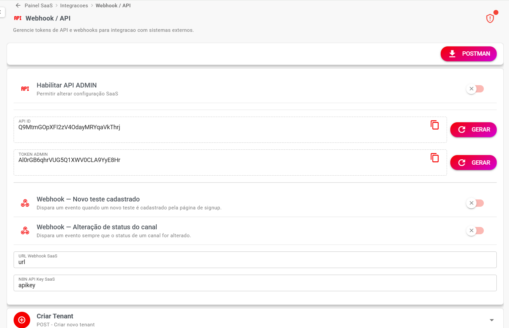

# 📘 API SaaS

**Descrição**: Esta API permite criar e atualizar empresas (tenants) no sistema Whazing, gerenciar faturas e notas fiscais (NFS-e).

Os dados (API ID e Token) podem ser obtidos no painel SaaS na área **Webhook / API**. Para funcionar, a API tem que estar habilitada.

Baixe o Postman do painel SaaS — a área de API disponibiliza endpoints compatíveis com sua versão.

Segue exemplo de um bot no Typebot para criar Empresa:

* Faça o [download do arquivo modelo](https://github.com/cleitonme/Whazing-SaaS/blob/main/docs/api_saas/modelo_cadastro_teste.json)

Você pode usar esses endpoints para integrar diretamente com seu sistema, criar bots que criam testes, renovam planos, alteram senhas etc.

***

## Onde configurar

Acesse:

**Painel SaaS → Integrações → Webhook / API**

> Gerencie tokens de API e webhooks para integração com sistemas externos.

<figure><figcaption></figcaption></figure>

***

## Habilitar API ADMIN

Habilite esta opção para ativar a API.

* **Permitir alterar configuração SaaS**

Quando desativada, a API não poderá ser utilizada.

***

## Credenciais da API

### API ID

Identificador da API utilizado nas requisições.

Exemplo:

```
Q9MtmGOpXFI2zV4OdayMRYqaVkThrj
```

### TOKEN ADMIN

Token de administrador utilizado para autenticar as requisições.

Exemplo:

```
Al0rGB6qhrVUG5Q1XWV0CLA9YyE8Hr
```

> ⚠️ Nunca compartilhe o **TOKEN ADMIN**. Quem possuir o token poderá alterar configurações do SaaS.

***

## Webhooks

### Webhook — Novo teste cadastrado

Dispara um evento quando um novo teste é cadastrado pela página de signup.

### Webhook — Alteração de status do canal

Dispara um evento sempre que o status de um canal for alterado.

### URL Webhook SaaS

Informe a URL para onde o SaaS enviará os eventos de webhook.

### N8N API Key SaaS

Chave de API utilizada para integração com o N8N.

***

## Endpoints disponíveis

### Tenants

| Endpoint        | Método | Descrição                     |
| --------------- | ------ | ----------------------------- |
| Criar Tenant    | POST   | Criar novo tenant             |
| Editar Tenant   | POST   | Atualizar dados do tenant     |
| Listar Tenants  | GET    | Listar todos ou específico    |
| Adicionar 1 Mês | POST   | Adicionar 1 mês ao vencimento |
| Listar Usuários | GET    | Listar usuários do tenant     |
| Listar Planos   | GET    | Listar Planos                 |

### Faturas

| Endpoint                  | Método | Descrição                                         |
| ------------------------- | ------ | ------------------------------------------------- |
| Listar Faturas            | GET    | Histórico de faturas de um tenant                 |
| Faturas em Aberto         | GET    | Somente faturas com status open                   |
| Gerar Pagamento / QR Code | POST   | Gera URL ou QR PIX via gateway configurado        |
| Marcar como Paga          | POST   | Baixa manual + estende vencimento do tenant       |
| Criar Cobrança Avulsa     | POST   | Cria fatura com valor e vencimento personalizados |
| Editar Fatura             | PUT    | Atualiza valor, vencimento ou descrição           |
| Excluir Fatura            | DELETE | Remove a fatura e reprocessa as abertas           |
| Recriar Faturas           | POST   | Deleta abertas e recria via InvoiceCreateJob      |

### NFS-e (Nota Fiscal de Serviço)

| Endpoint                 | Método | Descrição                                    |
| ------------------------ | ------ | -------------------------------------------- |
| Consultar Dados Fiscais  | GET    | Dados fiscais de um tenant (NFS-e)           |
| Atualizar Dados Fiscais  | PUT    | Atualiza dados fiscais do tenant (NFS-e)     |
| Emitir NFS-e             | POST   | Emite NFS-e para uma invoice paga            |
| Forçar Autorização NFS-e | POST   | Reprocessa autorização manualmente no Asaas  |
| Cancelar NFS-e           | POST   | Cancela nota fiscal no Asaas                 |
| Sincronizar NFS-e        | POST   | Sincroniza status com o Asaas                |
| Listar NFS-e             | GET    | Lista notas fiscais com filtros e paginação  |
| Detalhe NFS-e            | GET    | Dados completos de uma NFS-e pelo ID interno |
| NFS-e por Invoice        | GET    | NFS-e ativa vinculada a uma fatura           |
| Download PDF da NFS-e    | GET    | Proxy do PDF da nota fiscal via Asaas        |
| Download XML da NFS-e    | GET    | Proxy do XML da nota fiscal via Asaas        |
