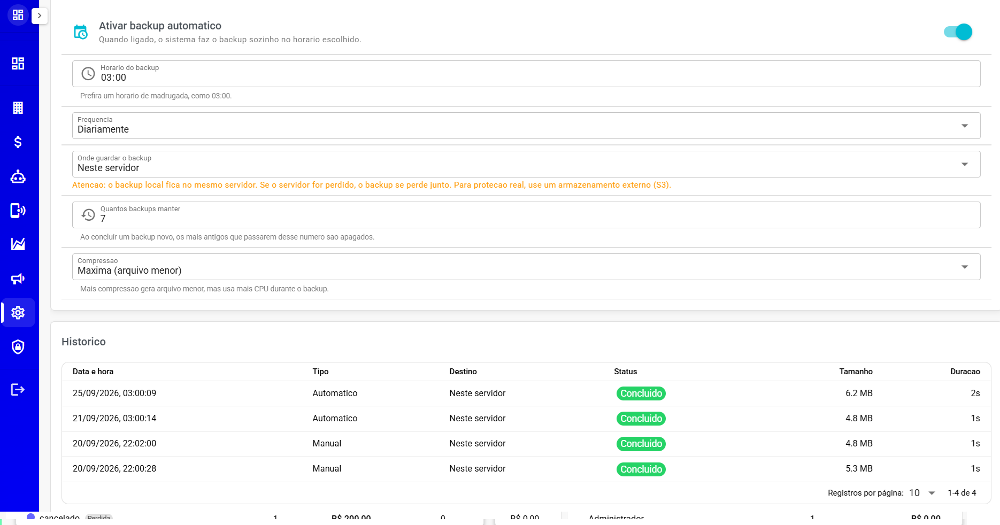

# Backup do Banco

A partir do Painel SaaS, o administrador pode fazer **cópia de segurança do banco de dados** da plataforma — sob demanda ou **programada para rodar sozinho** em dias e horários fixos.

> ⚠️ **Este recurso é exclusivo do Painel SaaS (Super Admin).** Não aparece para as empresas/clientes do sistema e não precisa ser configurado por eles — a proteção de backup é responsabilidade de quem administra a instalação.

## 📍 Onde encontrar

1. Acesse o **Painel SaaS - Sistema - Backup do Banco**

A tela é dividida em quatro blocos: **Situação**, **Backup automático**, **Armazenamento externo (S3)** e **Histórico**.

***

## ⚠️ Antes de usar: consumo de recursos

> **⚠️ O processo de backup pode consumir bastante processamento do servidor e, durante sua execução, deixar o sistema mais lento. Programe os backups, de preferência, em horários de menor utilização.**

* A própria tela reforça: o backup roda **em segundo plano, com prioridade baixa**, para atrapalhar menos o atendimento — mas em bases grandes a diferença pode ser perceptível.
* **Recomendado:** deixar o horário programado na **madrugada** (o padrão sugerido é **03:00**), quando o sistema tem menos uso.
* Ao clicar em **"Fazer backup agora"**, o sistema repete o aviso antes de começar.

***

## 🕐 Backup automático

A seção **"Backup automático"** programa a rotina que roda sozinha:

| Opção                        | O que faz                                                                                                                                                                  |
| ---------------------------- | -------------------------------------------------------------------------------------------------------------------------------------------------------------------------- |
| **Ativar backup automático** | Quando ligado, o sistema faz o backup sozinho no horário escolhido                                                                                                         |
| **Horário do backup**        | Hora em que a rotina roda (campo de hora; a dica da tela é madrugada, ex.: 03:00)                                                                                          |
| **Frequência**               | **"Diariamente"** ou **"Semanalmente"**                                                                                                                                    |
| **Dia da semana**            | Aparece só na frequência **Semanalmente** — escolha o dia (domingo a sábado)                                                                                               |
| **Onde guardar o backup**    | **"Neste servidor"** ou **"Armazenamento externo (S3)"** — veja abaixo                                                                                                     |
| **Quantos backups manter**   | **Retenção**: ao concluir um backup novo, os mais antigos que passarem desse número são apagados automaticamente (padrão: 7)                                               |
| **Compressão**               | **"Desligada (mais rápido)"**, **"Normal (recomendado)"** ou **"Máxima (arquivo menor)"**. Mais compressão gera arquivo menor, mas usa mais processamento durante o backup |

Cada alteração é salva na hora — aparece a confirmação **"Configuração salva."**

> ⚠️ **Destino "Neste servidor":** o backup fica **no mesmo servidor do sistema**. Se o servidor for perdido, o backup se perde junto. Para proteção real, use o **armazenamento externo (S3)** — o próprio sistema destaca esse aviso quando o destino local está escolhido.

Local fica na pasta /home/deploy/whazing/backend/private/backups

***

## 🗄️ Armazenamento externo (S3)

Aparece quando o destino é **"Armazenamento externo (S3)"**. É compatível com Amazon S3, Cloudflare R2, Backblaze B2, MinIO e Wasabi — use **credenciais dedicadas ao backup**, separadas das mídias.

| Campo                           | O que é                                                                                                                                  |
| ------------------------------- | ---------------------------------------------------------------------------------------------------------------------------------------- |
| **Bucket**                      | Nome do bucket de destino                                                                                                                |
| **Região**                      | Região do provedor (ex.: `us-east-1`)                                                                                                    |
| **Endpoint**                    | Endereço próprio do provedor. **Deixe em branco para Amazon S3**                                                                         |
| **Access Key**                  | Chave de acesso                                                                                                                          |
| **Secret Key**                  | Chave secreta. Por segurança **nunca é exibida** — deixe em branco para manter a atual (o campo mostra quando já existe uma configurada) |
| **Pasta (prefixo)**             | Pasta dentro do bucket onde os arquivos ficam (ex.: `backups`)                                                                           |
| **Usar caminho no estilo path** | Necessário em MinIO e alguns provedores compatíveis                                                                                      |

Ao final, clique em **"Testar conexão"** — a tela confirma se a comunicação com o armazenamento funcionou antes de você confiar na configuração.

***

## ▶️ Backup manual ("Fazer backup agora")

Precisa de uma cópia fora da rotina?

1. No bloco **"Situação"**, clique em **"Fazer backup agora"**.
2. Confirme a janela de atenção (consumo de recursos/lentidão temporária).
3. O backup **inicia em segundo plano**: o bloco **Situação** passa a mostrar **"Backup em andamento"**, com a hora de início e uma barra de progresso. A tela acompanha o andamento sozinha.

***

## 📊 Situação e Histórico

* **Situação** — mostra o que está acontecendo agora: **"Backup em andamento"** (com a hora de início), o **resultado do último backup** (etiqueta colorida **Concluído**, **Erro** ou **Cancelado**, com data/hora, tamanho do arquivo e a mensagem de erro, se houver) e a data/hora do **"Próximo backup"** programado. Se nenhum backup foi feito ainda, mostra **"Nenhum backup foi feito ainda."**
* **Histórico** — tabela com todos os backups: **Data e hora**, **Tipo** (Automático ou Manual), **Destino**, **Status**, **Tamanho** e **Duração**. Passe o mouse sobre o status para ver a mensagem de erro, quando existir.

<figure><figcaption></figcaption></figure>

***

> 💡 **Rotina recomendada:** backup **diário**, na **madrugada**, com destino **S3 externo** e retenção que caiba no seu espaço de armazenamento. Assim, mesmo um problema grave no servidor não apaga as cópias.
