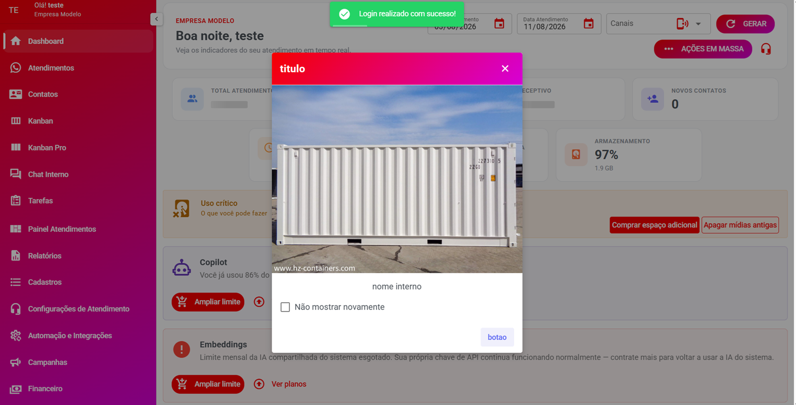

# Comunicados

**Disponível a partir da versão 3.0**

O recurso **Comunicados** permite enviar avisos e informações importantes para as empresas que utilizam o sistema.

Você pode criar comunicados para **todas as empresas** ou selecionar empresas específicas, definir quem deve receber o aviso e escolher como ele será apresentado na tela.

É possível incluir **textos, imagens, botões e links**, além de definir quando o comunicado deve começar e deixar de ser exibido.

<figure><figcaption></figcaption></figure>

***

### 🎯 Para que serve?

Os Comunicados podem ser usados para informar sobre:

* Novos recursos do sistema
* Manutenções programadas
* Atualizações importantes
* Novidades da plataforma
* Alterações em funcionalidades
* Avisos gerais
* Promoções ou campanhas
* Instruções importantes para os usuários

Por exemplo:

> "🚀 Uma nova versão do sistema está disponível! Confira as novidades."

O comunicado pode ser exibido automaticamente para os usuários dentro do sistema.

***

## ➕ Criando um comunicado

Para criar um novo comunicado, preencha as informações desejadas.

Nem todos os campos precisam ser utilizados. Você pode criar um comunicado simples ou personalizado.

***

### 📝 Conteúdo

Defina o conteúdo que será apresentado aos usuários.

Você pode utilizar:

* Texto
* Imagens
* Botões
* Links

Use imagens quando quiser destacar visualmente uma novidade ou aviso.

Os botões podem direcionar o usuário para uma página do sistema ou para um link externo.

***

## 👥 Público do comunicado

Você pode escolher exatamente quem deverá visualizar o comunicado.

### Empresas

Existem duas opções:

#### Todas as empresas

O comunicado será disponibilizado para **todas as empresas** cadastradas no sistema.

Essa opção é indicada para avisos gerais.

#### Empresas específicas

Permite selecionar somente determinadas empresas.

Use essa opção quando o comunicado for relevante apenas para alguns clientes.

***

### 🆕 Clientes novos ou antigos

Também é possível definir o público de acordo com o tempo de utilização da plataforma:

* **Clientes novos**
* **Clientes antigos**

Isso permite, por exemplo, apresentar uma mensagem de boas-vindas somente para novos clientes.

***

## 👤 Perfis de usuário

Você pode escolher quais tipos de usuários poderão visualizar o comunicado.

As opções são:

* **Administrador**
* **Supervisor**
* **Usuário comum**

#### Nenhum perfil selecionado

Se nenhum perfil for selecionado, o comunicado será exibido para **todos os perfis de usuário**.

***

## 💳 Planos

Também é possível limitar o comunicado aos clientes que utilizam determinados planos.

#### Planos específicos

Selecione os planos que devem receber o comunicado.

#### Nenhum plano selecionado

Se nenhum plano for selecionado, o comunicado será exibido para **todos os planos**.

***

## 🖥️ Forma de exibição

Atualmente, o comunicado pode ser apresentado como:

#### Popup Modal

O comunicado aparece em uma janela sobre o sistema.

Essa opção é recomendada para avisos importantes que precisam chamar a atenção do usuário.

***

## ⭐ Prioridade

A prioridade determina a importância do comunicado.

#### Normal

Utilizada para avisos comuns.

Caso existam vários comunicados disponíveis, a prioridade e a ordem podem ajudar a definir qual será apresentado primeiro.

***

## 📐 Personalização do Popup

Você pode personalizar a aparência da janela do comunicado.

#### Tamanho do popup

Define o tamanho da janela apresentada ao usuário.

#### Posição

Define onde o popup será apresentado na tela.

#### Cor de fundo

Define a cor de fundo da janela do comunicado.

#### Cor do texto

Define a cor dos textos apresentados dentro do popup.

#### Cor do overlay

Define a cor da área que aparece atrás do popup.

Essa área é o **"véu" que cobre o restante da tela** enquanto o comunicado está aberto.

Se nenhuma cor for informada, será utilizada a cor padrão do sistema.

***

## ❌ Botão X

A opção **Mostrar botão X** controla se o ícone de fechar será apresentado no canto do popup.

Quando ativado, o usuário poderá visualizar o botão **X** para fechar o comunicado.

> O botão X não ficará disponível caso a opção **Permitir fechar** esteja desligada.

***

## 🔒 Permitir fechar

Define se o usuário poderá fechar o comunicado.

#### Ativado

O usuário poderá fechar o popup normalmente.

#### Desligado

O comunicado não poderá ser fechado pelo usuário.

Nesse caso, o usuário não poderá fechá-lo através de:

* Botão X
* Clique fora do popup
* Tecla ESC

> ⚠️ Utilize essa opção somente quando for realmente necessário que o usuário leia o comunicado.

***

## ☑️ Não mostrar novamente

A opção **Oferecer "não mostrar novamente"** permite que o usuário escolha não visualizar aquele comunicado novamente.

Quando ativada, será apresentado um checkbox para o usuário.

Por exemplo:

> ☑ Não mostrar novamente

Se o usuário marcar essa opção, o comunicado não será apresentado novamente para ele.

Essa opção é recomendada para avisos que não precisam ser exibidos toda vez que o usuário acessar o sistema.

***

## 🔢 Ordem

A opção **Ordem** permite definir a sequência dos comunicados.

Por exemplo:

* Ordem `0` → aparece primeiro
* Ordem `1` → aparece depois
* Ordem `2` → aparece depois do anterior

Quando existem vários comunicados ativos, utilize a ordem para controlar a prioridade de apresentação.

***

## 🔄 Frequência

Define com que frequência o comunicado poderá ser apresentado.

#### Sempre

O comunicado poderá ser exibido sempre que estiver dentro das condições configuradas.

A frequência deve ser escolhida de acordo com a importância do aviso e com a experiência desejada para o usuário.

***

## 📅 Agendamento

Você pode definir uma data de **início** e uma data de **fim** para o comunicado.

#### Data de início

Define quando o comunicado começará a ser exibido.

#### Data de fim

Define quando o comunicado deixará de ser exibido.

Isso permite deixar comunicados preparados antecipadamente.

#### Exemplo

Você pode criar hoje um comunicado sobre uma manutenção que acontecerá no final de semana:

**Início:** 15/08/2026\
**Fim:** 16/08/2026

Durante esse período, o comunicado ficará disponível conforme as demais regras configuradas.

***

## 💡 Exemplo prático

Imagine que uma nova funcionalidade foi adicionada ao sistema e você deseja avisar somente os administradores dos clientes que utilizam determinados planos.

Você poderia configurar:

**Empresas:** Todas as empresas\
**Perfis:** Administrador\
**Planos:** Planos específicos\
**Forma de exibição:** Popup Modal\
**Prioridade:** Normal\
**Mostrar botão X:** Sim\
**Permitir fechar:** Sim\
**Não mostrar novamente:** Sim\
**Início:** Data da publicação\
**Fim:** Data definida para encerrar o aviso

Dessa forma, somente os administradores dos planos selecionados receberão o comunicado.

***

## ✅ Resumo

O recurso **Comunicados** permite controlar:

| Configuração           | O que permite definir                      |
| ---------------------- | ------------------------------------------ |
| Empresas               | Quem receberá o comunicado                 |
| Clientes novos/antigos | Público baseado no tempo de utilização     |
| Perfis                 | Administrador, Supervisor ou Usuário comum |
| Planos                 | Quais planos receberão o aviso             |
| Conteúdo               | Texto, imagens, botões e links             |
| Forma de exibição      | Como o comunicado aparecerá                |
| Prioridade             | Importância do comunicado                  |
| Tamanho                | Dimensão do popup                          |
| Posição                | Localização do popup                       |
| Cores                  | Personalização visual                      |
| Botão X                | Exibição do botão de fechar                |
| Permitir fechar        | Permite ou impede o fechamento             |
| Não mostrar novamente  | Permite ao usuário ocultar o comunicado    |
| Ordem                  | Sequência de apresentação                  |
| Frequência             | Quantas vezes poderá aparecer              |
| Agendamento            | Data de início e fim                       |

> **💡 Dica:** para comunicados importantes, mantenha o texto curto e objetivo. Use imagens e botões quando ajudarem o usuário a entender ou acessar rapidamente a informação.
