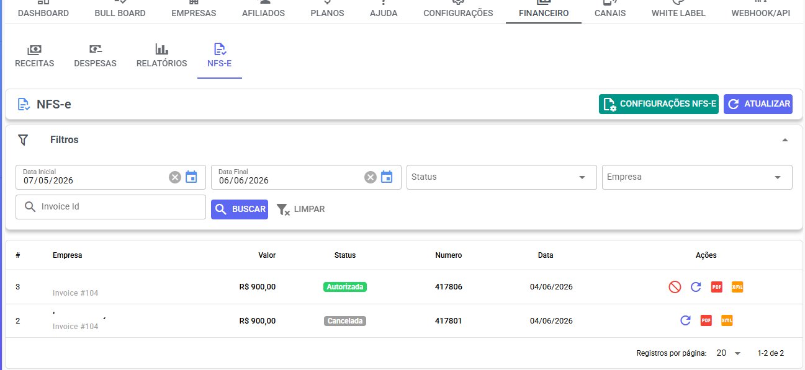
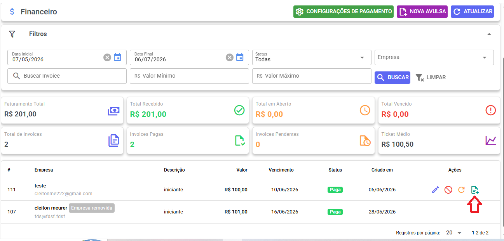

# Configuração da Emissão de NFS-e com Asaas no Whazing

### Visão Geral

O módulo de emissão de NFS-e do Whazing permite emitir notas fiscais automaticamente para seus clientes através da integração com o Asaas.

> Importante: O Asaas cobra atualmente R$ 0,49 por NFS-e emitida. O uso do Asaas para emissão de notas fiscais não exige que os pagamentos sejam recebidos pelo Asaas. Você pode utilizar Mercado Pago, Pix, Stripe ou qualquer outro meio de pagamento e usar apenas o Asaas para emissão das notas fiscais.

### Bônus de Cadastro

Ao criar sua conta através do link abaixo, você recebe um bônus de R$ 50,00:

[https://www.asaas.com/r/MJVUJPJY](https://www.asaas.com/r/MJVUJPJY)

***

## Antes de começar

Antes de configurar o Whazing, é obrigatório concluir toda a configuração fiscal dentro do Asaas e validar que sua empresa já consegue emitir uma NFS-e avulsa diretamente pelo portal do Asaas.

Somente após conseguir emitir uma nota fiscal manualmente no Asaas recomenda-se configurar a integração no Whazing.

#### Dados fiscais da empresa

Os dados fiscais utilizados na emissão da nota são de responsabilidade exclusiva da empresa emissora.

Recomendamos validar todas as informações junto ao seu contador antes de iniciar a emissão automática.

Alguns dados podem ser consultados através do Emissor Nacional da NFS-e:

[https://www.nfse.gov.br/EmissorNacional/](https://www.nfse.gov.br/EmissorNacional/)

***

## Passo 1 - Configurar a emissão no Asaas

No painel do Asaas:

1. Configure a emissão de NFS-e.
2. Realize todas as validações exigidas pelo município.
3. Cadastre:
   * Código de Serviço
   * Nome do Serviço Municipal
   * Alíquota
   * Código NBS
4. Realize um teste emitindo uma nota fiscal avulsa.

> Os mesmos dados utilizados no teste serão utilizados posteriormente na configuração do Whazing.

***

## Passo 2 - Criar API Key

No Asaas:

1. Acesse as configurações da conta.
2. Gere uma API Key.
3. Copie a chave gerada.

Ela será utilizada na configuração do Whazing.

***

## Passo 3 - Criar o Webhook

No Asaas:

1. Crie um novo Webhook.
2. Utilize a URL exibida na tela de configuração NFS-e do Whazing.
3. Habilite todos os eventos relacionados a notas fiscais.
4. Salve a configuração.

Após o cadastro, o Asaas irá gerar um Token do Webhook.

Copie esse token para preenchimento na configuração do Whazing.

***

## Passo 4 - Configurar NFS-e no Whazing

Acesse:

**Painel SaaS → Financeiro → NFS-e → Configurar NFS-e**

Preencha:

* API Key do Asaas
* Token do Webhook
* Código de Serviço
* Nome do Serviço Municipal
* Alíquota
* Código NBS
* Descrição Padrão
* Observação Padrão

***

## Variáveis disponíveis

Os campos Descrição Padrão e Observação Padrão aceitam variáveis dinâmicas:

| Variável      | Descrição          |
| ------------- | ------------------ |
| #{invoiceId}  | ID da fatura       |
| #{tenantName} | Nome da empresa    |
| #{value}      | Valor da fatura    |
| #{dueDate}    | Data de vencimento |

#### Exemplo de descrição

Serviços de SaaS - Fatura #{invoiceId}

#### Exemplo de observação

Referente à Fatura FAT-#{invoiceId}

***

## Passo 5 - Habilitar emissão global

Após concluir a configuração:

Acesse:

**Painel SaaS → Financeiro → NFS-e - Configuração NFS-e**

Ative a opção:

**Habilitar emissão global de NFS-e**

Quando esta opção estiver habilitada:

* Os clientes poderão informar seus dados fiscais.
* Será exibida a opção para habilitar emissão de NFS-e individualmente.
* O sistema poderá emitir notas automaticamente para clientes habilitados.

***

## Configuração dos dados fiscais do cliente

Acesse:

**Painel SaaS → Empresas**

No menu de ações da empresa:

**Dados Fiscais**

Preencha todas as informações solicitadas.

> A responsabilidade pelas informações fiscais fornecidas é do cliente emissor da nota.

***

## Habilitando emissão para uma empresa

Dentro dos Dados Fiscais da empresa existe a opção:

**Habilitar emissão de notas fiscais**

Essa configuração é individual para cada empresa.

Somente empresas com:

* Dados fiscais preenchidos;
* Emissão habilitada;

participarão da emissão automática.

***

## Emissão automática

Quando uma fatura for confirmada como paga:

* O Whazing solicitará automaticamente a emissão da NFS-e.
* O PDF da nota ficará disponível na fatura.
* O XML da nota também ficará disponível para download.

A emissão automática ocorre apenas para empresas elegíveis e corretamente configuradas.

***

## Acompanhamento das notas fiscais

Acesse:

**Painel SaaS → Financeiro → NFS-e**

Nesta tela você poderá:

* Visualizar notas emitidas.
* Ver erros de emissão.
* Atualizar status.
* Cancelar notas.
* Baixar PDF.
* Baixar XML.

<figure><figcaption></figcaption></figure>

***

## Emissão manual

Caso uma nota não tenha sido emitida automaticamente, ela poderá ser emitida manualmente.

Acesse:

**Painel SaaS → Financeiro → Receitas**

Abra uma fatura paga e utilize:

**Emitir NFS-e**

O sistema enviará a solicitação ao Asaas e atualizará o status da nota.

<figure><figcaption></figcaption></figure>

***

## Cancelamento de faturas

As faturas ficam vinculadas às notas fiscais emitidas.

Por segurança:

* Uma fatura vinculada a uma NFS-e válida não poderá ser cancelada.
* Primeiro é necessário cancelar a NFS-e.
* Após o cancelamento da NFS-e, a fatura poderá ser cancelada normalmente.

Isso evita inconsistências fiscais e contábeis.

***

## Resumo

Fluxo recomendado:

1. Configurar emissão no Asaas.
2. Validar emissão de nota avulsa.
3. Criar API Key.
4. Criar Webhook.
5. Configurar NFS-e no Whazing.
6. Habilitar emissão global.
7. Configurar dados fiscais dos clientes.
8. Habilitar emissão para as empresas desejadas.
9. Acompanhar emissões em Financeiro → NFS-e.

Pronto! O Whazing passará a emitir NFS-e automaticamente sempre que uma cobrança elegível for confirmada como paga.
