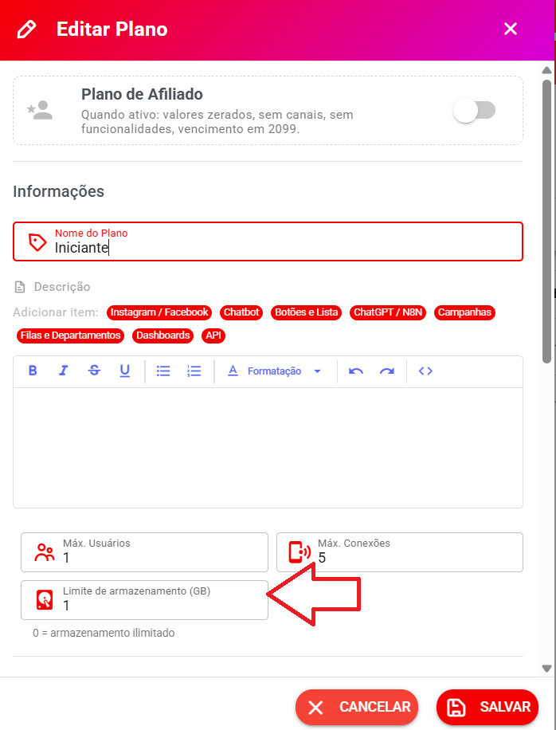
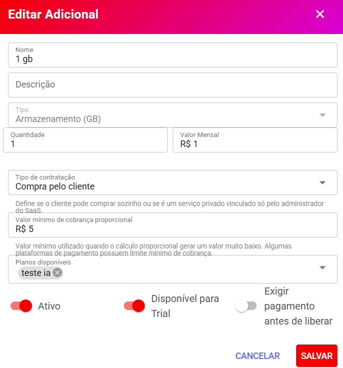
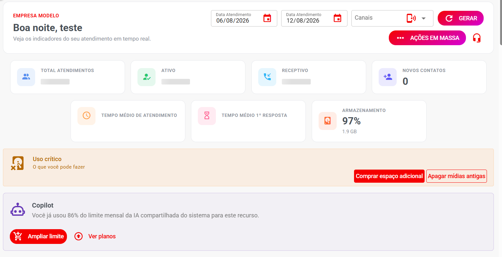
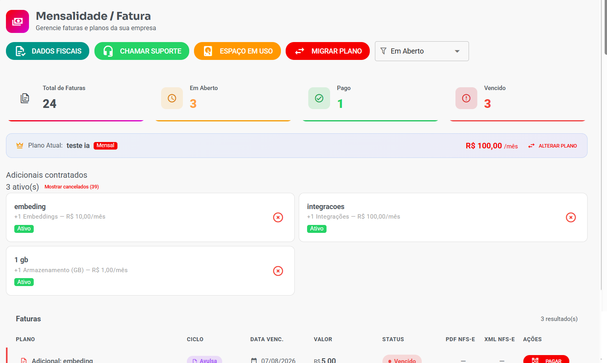
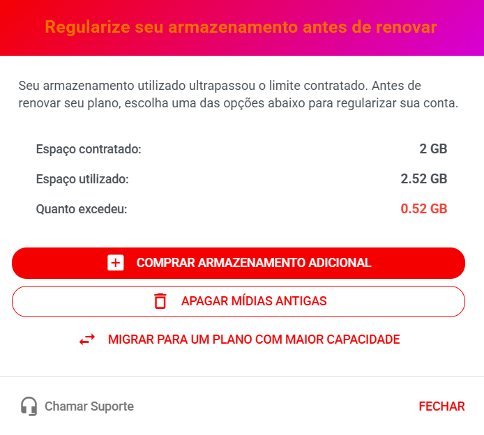

# Controle de Espaço em Uso e Venda de Adicionais de Armazenamento

> **Disponível a partir da versão 3.0**

O Whazing permite controlar quanto espaço de armazenamento cada empresa pode utilizar e oferecer **espaço adicional como uma compra separada**.

Esse recurso permite que o administrador do SaaS defina um limite de armazenamento no plano e, quando necessário, venda GB adicionais para o cliente.

***

### 📌 O que é o espaço em uso?

O sistema calcula automaticamente o espaço utilizado pela empresa para armazenar arquivos, mídias e outros conteúdos.

O armazenamento pode ser controlado diretamente pelo plano contratado.

Por exemplo:

* Plano com **5 GB** → empresa pode utilizar até 5 GB.
* Plano com **20 GB** → empresa pode utilizar até 20 GB.
* Plano com **0 GB** → armazenamento **ilimitado**.

> 💡 **Importante:** quando o cliente ultrapassa o limite, o sistema **não bloqueia imediatamente o funcionamento da empresa**. Os arquivos continuam sendo baixados normalmente. O sistema apenas informa que é necessário regularizar o armazenamento.

***

## 🏢 Configurando o limite no plano

Para configurar o espaço disponível:

**Painel SaaS → Comercial → Planos**

Ao criar ou editar um plano, localize:

#### Limite de armazenamento (GB)

Informe a quantidade de GB permitida para as empresas daquele plano.

| Valor | Significado             |
| ----- | ----------------------- |
| `0`   | Armazenamento ilimitado |
| `1`   | 1 GB                    |
| `5`   | 5 GB                    |
| `10`  | 10 GB                   |
| `50`  | 50 GB                   |

#### 📸 Sugestão de imagem

**Captura de tela:** tela de cadastro/edição de plano destacando o campo **"Limite de armazenamento (GB)"**.

<figure><figcaption></figcaption></figure>

***

## 💰 Criando um adicional de armazenamento

Quando o espaço incluído no plano não for suficiente, o SaaS pode oferecer um adicional de armazenamento.

Acesse:

**Painel SaaS → Comercial → Adicionais**

Clique em **Criar Adicional**.

Na tela de cadastro, configure:

#### Nome

Nome que será apresentado para o cliente.

Exemplo:

**Armazenamento adicional**

#### Descrição

Explique o que o adicional oferece.

Exemplo:

> Adicione espaço de armazenamento à sua conta.

#### Tipo

Selecione:

**Armazenamento (GB)**

#### Quantidade

Informe quantos GB serão adicionados.

Exemplo:

**1 GB**

Se quiser vender um pacote maior:

**10 GB**

#### Valor mensal

Informe o preço mensal do adicional.

Exemplo:

**R$ 1,00**

***

### 🧾 Tipo de contratação

O campo **Tipo de contratação** determina quem pode contratar o adicional.

#### Compra pelo cliente

Permite que o próprio cliente contrate o adicional pelo sistema, quando estiver disponível para o plano.

Também existe a possibilidade de o adicional ser utilizado como um serviço privado, dependendo da configuração realizada pelo administrador do SaaS.

***

## 💵 Valor mínimo de cobrança proporcional

O cadastro possui o campo:

**Valor mínimo de cobrança proporcional**

Exemplo:

**R$ 5,00**

Esse valor é utilizado quando o cálculo proporcional gerar uma cobrança muito baixa.

Isso é importante porque algumas plataformas de pagamento possuem um **valor mínimo permitido para uma cobrança**.

#### Exemplo

Um cliente contrata um adicional próximo da data de vencimento.

O sistema calcula somente alguns dias de utilização e o valor proporcional poderia resultar em:

**R$ 0,80**

Se o valor mínimo configurado for:

**R$ 5,00**

o sistema utiliza o valor mínimo definido para evitar uma cobrança abaixo do limite.

> 💡 O valor mínimo deve ser configurado de acordo com as regras da plataforma de pagamento utilizada pelo SaaS.

***

## 📋 Planos disponíveis

Ao cadastrar o adicional, é possível definir quais planos podem utilizar esse adicional.

Por exemplo:

**Armazenamento adicional — 1 GB**

Disponível para:

* Plano Inicial
* Plano Premium
* Plano Empresarial

Isso permite criar adicionais diferentes para diferentes planos.

<figure><figcaption></figcaption></figure>

***

## ⚙️ Outras opções do adicional

O cadastro também possui opções como:

#### Ativo

Define se o adicional está disponível para utilização.

#### Disponível para Trial

Define se o adicional poderá ser utilizado durante o período de teste.

#### Exigir pagamento antes de liberar

Quando ativado, o adicional somente será liberado após a confirmação do pagamento.

***

## 🛒 Cliente comprando espaço adicional

Depois que o adicional estiver configurado e disponibilizado para o plano do cliente, ele poderá contratar espaço adicional diretamente pelo sistema, quando essa opção estiver disponível no **Dashboard** ou no **Financeiro**.

O cliente poderá visualizar a necessidade de aumentar o armazenamento e contratar o adicional disponível.

<figure><figcaption></figcaption></figure>

***

## 👨‍💼 Adicionando espaço manualmente pela empresa

O administrador do SaaS também pode adicionar um adicional diretamente para uma empresa.

Acesse:

**Painel SaaS → Empresas → Empresas**

Abra a empresa desejada e utilize a área de **adicionais contratados**.

Essa opção é útil quando o administrador deseja liberar um adicional diretamente para o cliente.

***

## 📦 Adicionais contratados

Depois que os adicionais forem contratados ou adicionados à empresa, eles podem aparecer na lista de **Adicionais contratados**.

Exemplo:

| Adicional          | Status | Cliente | Quantidade |     Valor |
| ------------------ | ------ | ------- | ---------: | --------: |
| Embeddings         | Ativo  | Cliente |         +1 |  R$ 10,00 |
| Integrações        | Ativo  | Cliente |         +1 | R$ 100,00 |
| Armazenamento (GB) | Ativo  | Cliente |      +1 GB |   R$ 1,00 |

<figure><figcaption></figcaption></figure>

***

## 🌙 Cálculo automático do armazenamento

O cálculo do espaço utilizado é realizado **automaticamente durante a madrugada**.

Essa rotina foi criada para evitar que o cálculo constante do armazenamento prejudique o desempenho do sistema durante o horário comercial.

O sistema verifica o espaço utilizado pelas empresas e atualiza as informações de armazenamento.

***

## ⚠️ O que acontece quando o cliente ultrapassa o limite?

Quando uma empresa ultrapassa o espaço disponível no plano:

**O sistema não bloqueia imediatamente a empresa.**

O funcionamento continua normalmente, incluindo o download de novos arquivos.

Porém, o sistema passa a informar que o espaço utilizado está acima do limite.

O cliente poderá visualizar a necessidade de:

1. **Contratar espaço adicional**, ou
2. **Apagar arquivos para liberar espaço.**

#### Exemplo

Plano:

**5 GB**

Espaço utilizado:

**6,2 GB**

Nesse caso:

> ⚠️ Espaço utilizado acima do limite do plano.

O sistema continuará funcionando, mas apresentará a orientação para regularizar o armazenamento.

***

## 💳 O que acontece na renovação da mensalidade?

Existe uma regra importante para empresas que estão acima do limite de armazenamento.

Quando o cliente tentar renovar/pagar a mensalidade, o sistema verifica novamente o espaço utilizado.

Se a empresa estiver acima do limite permitido, ela deverá **regularizar o armazenamento antes de renovar o plano**.

O cliente poderá:

#### Opção 1 — Comprar armazenamento adicional

Contratar um adicional de armazenamento disponível para o plano.

#### Opção 2 — Apagar arquivos

Excluir arquivos antigos ou desnecessários para ficar dentro do limite contratado.

Somente depois de regularizar o armazenamento a renovação poderá prosseguir.

<figure><figcaption></figcaption></figure>

***

## 📅 Cálculo proporcional

Quando um adicional é contratado no meio do ciclo de cobrança, o sistema pode calcular o valor proporcional referente ao período restante.

#### Exemplo

O cliente possui um adicional de:

**1 GB — R$ 10,00/mês**

Se o adicional for contratado próximo ao vencimento, o sistema calcula somente o período correspondente até o próximo ciclo.

Isso evita cobrar o mês completo quando o cliente utilizou o adicional apenas durante parte do período.

> 💡 O sistema também considera o **valor mínimo de cobrança proporcional** configurado no cadastro do adicional.

***

## 🔄 Como funciona o processo completo?

O funcionamento pode ser resumido desta forma:

**1. Criar ou editar o plano**

Defina o limite de armazenamento em GB.

⬇️

**2. Criar o adicional**

Acesse **Painel SaaS → Comercial → Adicionais**.

⬇️

**3. Selecionar "Armazenamento (GB)"**

Informe a quantidade e o valor mensal.

⬇️

**4. Definir os planos disponíveis**

Escolha quais planos poderão contratar o adicional.

⬇️

**5. Cliente utiliza o sistema**

O armazenamento é utilizado normalmente.

⬇️

**6. Sistema calcula o armazenamento**

A verificação ocorre automaticamente durante a madrugada.

⬇️

**7. Cliente ultrapassa o limite**

O sistema mantém o funcionamento, mas informa que o armazenamento precisa ser regularizado.

⬇️

**8. Cliente regulariza**

Pode contratar espaço adicional ou apagar arquivos.

⬇️

**9. Renovação**

Na renovação, o sistema verifica se o armazenamento está regularizado.

***

## 📌 Exemplo completo

Imagine que uma empresa esteja no seguinte plano:

**Plano Premium**

* Armazenamento incluído: **10 GB**

A empresa já utilizou:

**10,8 GB**

Ela está utilizando **0,8 GB acima do limite**.

O administrador criou o seguinte adicional:

**Armazenamento (GB)**

* Quantidade: **1 GB**
* Valor mensal: **R$ 1,00**
* Plano disponível: **Premium**
* Status: **Ativo**

O cliente poderá contratar o adicional.

Depois da contratação:

**10 GB do plano + 1 GB adicional = 11 GB**

Como a empresa utiliza **10,8 GB**, ela passa a ficar dentro do limite.

***

## 💡 Recomendações para o administrador do SaaS

Para facilitar a utilização pelos clientes:

* Crie adicionais de armazenamento com quantidades fáceis de entender, como **1 GB, 5 GB e 10 GB**.
* Utilize nomes claros.
* Explique na descrição o que está sendo vendido.
* Selecione corretamente os planos disponíveis.
* Verifique o valor mínimo aceito pelo gateway de pagamento.
* Utilize **"Exigir pagamento antes de liberar"** quando desejar garantir a confirmação do pagamento antes da liberação.
* Mantenha os adicionais que não estão mais sendo vendidos como **inativos**, em vez de removê-los, quando isso for necessário para preservar o histórico.

***

### ❓ Perguntas frequentes

#### O que acontece quando o cliente ultrapassa o limite?

O sistema continua funcionando normalmente. O cliente é informado de que precisa regularizar o armazenamento.

#### O sistema apaga arquivos automaticamente?

Não. O cliente deve liberar espaço manualmente ou contratar armazenamento adicional.

#### Posso vender armazenamento sem alterar o plano?

Sim. O armazenamento adicional funciona como um **adicional separado** do plano.

#### Posso disponibilizar um adicional somente para alguns planos?

Sim. No cadastro do adicional é possível selecionar os **Planos disponíveis**.

#### O administrador pode adicionar armazenamento manualmente?

Sim. O dono do SaaS pode adicionar o serviço diretamente na empresa pelo:

**Painel SaaS → Empresas → Empresas**

#### O cálculo do armazenamento é realizado o tempo todo?

Não. O cálculo é realizado automaticamente durante a madrugada para reduzir o impacto no desempenho do sistema.

#### O cliente consegue renovar se estiver acima do limite?

Não. Na renovação, se o armazenamento estiver irregular, o cliente deverá primeiro contratar espaço adicional ou apagar arquivos para regularizar a situação.

#### O adicional contratado é cobrado integralmente se for contratado no meio do mês?

O sistema realiza o cálculo proporcional conforme o período de utilização, considerando também o **valor mínimo de cobrança proporcional** configurado no adicional.
