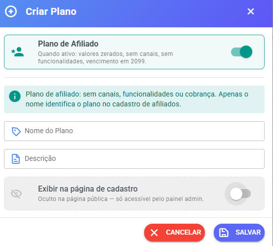
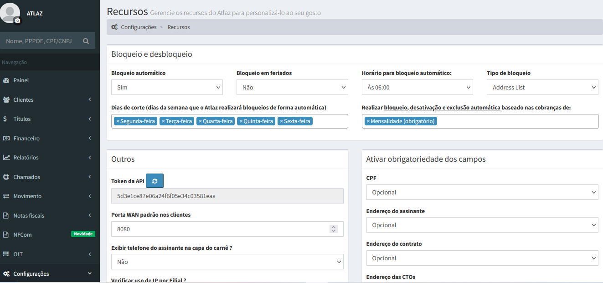

# Criação de Planos - Financeiro

## 1. Acessando o menu de planos

Para criar ou gerenciar planos disponíveis para seus clientes:

1. Acesse o **Painel SaaS**
2. Clique em **Comercial**
3. Clique em **Planos**
4. Clique no botão **Adicionar**

<figure><figcaption></figcaption></figure>

***

## 2. Criando um novo plano

Ao clicar em **Adicionar**, será exibido o modal **Criar Plano** com todas as configurações do plano.

***

### Plano de Afiliado

Opção utilizada para criar acessos exclusivos do **Programa de Afiliados**.

**Quando ativado:**

* Valores do plano ficam **zerados**
* Sem canais disponíveis
* Sem funcionalidades
* Vencimento automático definido para o ano **2099**

Esse modelo foi criado especialmente para que afiliados possam acompanhar seus resultados sem custo e sem acesso aos recursos do sistema.

<figure><figcaption></figcaption></figure>

Para mais detalhes, consulte:

[Programa de Afiliados (Indique e Ganhe)](../programa-de-afiliados-indique-e-ganhe.md)

***

### Informações

Aba de informações básicas do plano.

#### Nome do Plano

Nome que será exibido para os clientes.

Exemplos:

* Iniciante
* Profissional
* Empresarial

***

#### Descrição

Descrição para aparecer na tela de cadastro ou migração de plano do cliente. Aceita algumas personalizações HTML, segue alguns exemplos abaixo para cadastro no campo:

<figure><figcaption></figcaption></figure>

```
<ul>
  <li>Chatbot de atendimento</li>
  <li>Filas e departamentos</li>
  <li>Dashboards e relatórios</li>
  <li>API para integrações</li>
</ul>
```

```
<ul>
  <li>Instagram / Facebook <span class="extra">+R$ 99,90/canal</span></li>
  <li>Chatbot de atendimento</li>
  <li><strong>Botões e Lista</strong> <span class="extra">PLUS +R$ 49,90/canal</span></li>
  <li>Integração <strong>ChatGPT, N8N, Typebot</strong></li>
  <li>Campanhas em massa <span class="extra">opcional +R$ 99,90</span></li>
  <li>Filas e departamentos</li>
  <li>Dashboards e relatórios</li>
  <li>API para integrações</li>
</ul>
```

```
<ul>
  <li>Tudo do plano <strong>Pro</strong> incluído</li>
  <li>Instagram / Facebook <span class="extra">incluso</span></li>
  <li>Campanhas em massa <span class="extra">incluso</span></li>
  <li><strong>Botões e Lista</strong> <span class="extra">incluso</span></li>
  <li>Integração <strong>ChatGPT, N8N, Typebot</strong></li>
  <li>Webchat <span class="extra">incluso</span></li>
  <li>Filas e departamentos</li>
  <li>Dashboards e relatórios</li>
  <li>Suporte prioritário</li>
</ul>
```

***

#### Adicionar item

Na seção **Adicionar item** você define os limites do plano.

##### Máx. Usuários

Define **quantos atendentes podem utilizar o sistema** dentro desse plano.

Exemplo:

* 2 usuários
* 5 usuários
* 10 usuários

##### Máx. Conexões

Define **quantos números de WhatsApp ou outros canais como facebook e instagram podem ser conectados ao sistema**.

Exemplo:

* 1 conexão
* 3 conexões
* 10 conexões

##### Limite de armazenamento (GB)

Define o limite de armazenamento disponível para a empresa.

> 💡 **0 = armazenamento ilimitado**

Exemplo:

* 5 GB
* 10 GB
* 0 (ilimitado)

***

### Funcionalidades

Nesta seção você define quais funcionalidades estarão disponíveis para os clientes do plano.

#### Campanhas

Permite liberar o envio de campanhas em massa conforme o tipo:

* **Campanhas WhatsApp** — libera o envio de campanhas pela API não oficial
* **Campanhas Oficial** — libera o envio de campanhas pela API oficial (Meta)
* **Campanhas Email** — libera o envio de campanhas por e-mail
* **Campanhas SMS** — libera o envio de campanhas por SMS

Se desativado, o cliente não terá acesso à opção de campanha correspondente.

***

#### Canais Disponíveis

Selecione quais canais o cliente poderá conectar ao sistema:

* Whatsapp Api Oficial
* Whatsapp WuzAPI
* Whatsapp Plus
* Whatsapp Baileys
* Whatsapp Multi-WA
* Connection Hub
* NotificaMe Hub
* Telegram
* WebChat
* E-mail
* SMS

Somente os canais marcados ficarão disponíveis para os clientes do plano.

***

#### WaCalls (Chamadas de Voz)

Permite liberar o serviço de chamadas de voz via WhatsApp.

* **Disponível** — habilita o recurso para o plano

Depois existe o campo:

* **Quantidade de acessos WaCalls** — quantidade de acessos incluídos no plano

Exemplo:

```
1
```

> 💡 **Dica:** deixar a quantidade em `0` permite vender o WaCalls como **adicional** — o recurso fica disponível no plano, mas o acesso é contratado separadamente pelo cliente.

Para mais detalhes, consulte:

[WaCalls — Ativação Automática e Venda de Adicionais](../wacalls-ativacao-automatica-e-venda-de-adicionais.md)

***

### Serviços de IA

Define se este plano usa a **IA compartilhada do SaaS** (sem o cliente configurar nada) para cada recurso.

Para cada recurso, informe **qual serviço de IA atende** e o **limite mensal**:

* **Copilot** — assistente de IA disponível no atendimento
* **Smart Reception** — recepção/inteligência automática
* **Embeddings** — busca semântica e base de conhecimento
* **Resposta automática em redes sociais** — automação de respostas em redes sociais

> 💡 Deixar o **Limite mensal** vazio significa **ilimitado**.

Para mais detalhes, consulte:

[IA Integrada](../ia-integrada/README.md)

***

### Ciclos de cobrança

Nesta seção você define quais ciclos de cobrança estarão disponíveis para o plano e o valor de cada um.

Cada ciclo pode ser **habilitado ou desabilitado** individualmente:

* **Mensal** — informe o **Valor Mensal**

  Exemplos:

  * 49,90
  * 99,90
  * 199,90

* **Bimestral** — desabilitado por padrão
* **Trimestral** — desabilitado por padrão
* **Semestral** — desabilitado por padrão
* **Anual** — desabilitado por padrão

Para habilitar um ciclo, basta ativá-lo e informar o valor correspondente.

***

## 3. Vinculando plano a uma empresa

Após criar o plano, ele pode ser associado a uma empresa.

Para isso:

1. Acesse no painel SaaS o menu **Empresas**
2. Edite a empresa desejada
3. No campo **Plano**, selecione o plano criado.

<figure><figcaption></figcaption></figure>

***

## 4. Cobranças automáticas

O sistema gera automaticamente as cobranças.

### Como funciona

As cobranças:

* São geradas **automaticamente**
* Aparecem na área **Financeiro** do cliente
* São criadas **20 dias antes do vencimento**

<figure><figcaption></figcaption></figure>

<figure><figcaption></figcaption></figure>

***

> ⚠️ Importante

Se você:

* apagar uma cobrança
* alterar o plano do cliente

O sistema **irá gerar novamente as cobranças automaticamente**.

Basta aguardar.

***

## 5. Períodos de cobrança

O sistema suporta os seguintes ciclos de cobrança:

✔ Mensal

✔ Bimestral

✔ Trimestral

✔ Semestral

✔ Anual

Cada plano define quais ciclos estão habilitados e o valor de cada um na seção **Ciclos de cobrança**.

Ainda **não possui suporte para:**

* assinatura automática

***

## 6. Baixa automática de pagamentos

Para que pagamentos sejam baixados automaticamente no sistema, é necessário configurar **webhook do gateway de pagamento**.

Cada gateway possui sua própria configuração.

Consulte a documentação correspondente.

***

## 7. Baixa manual de faturas

Caso necessário, também é possível:

* dar **baixa manual**
* **excluir faturas**

Para isso:

1. Acesse **Empresas**
2. Clique em **Ações**
3. Acesse a área **Listar Faturar em Aberto**

<figure><figcaption></figcaption></figure>

***

## Conclusão

Agora você já sabe:

✔ Criar planos

✔ Definir limites de usuários, conexões e armazenamento

✔ Configurar funcionalidades e canais

✔ Configurar WaCalls

✔ Configurar serviços de IA

✔ Definir ciclos de cobrança e valores

✔ Associar planos a empresas

✔ Entender como funcionam as cobranças

***

✅ Isso permite criar **diferentes níveis de plano para seus clientes**, organizando recursos, serviços e limites dentro do sistema.
