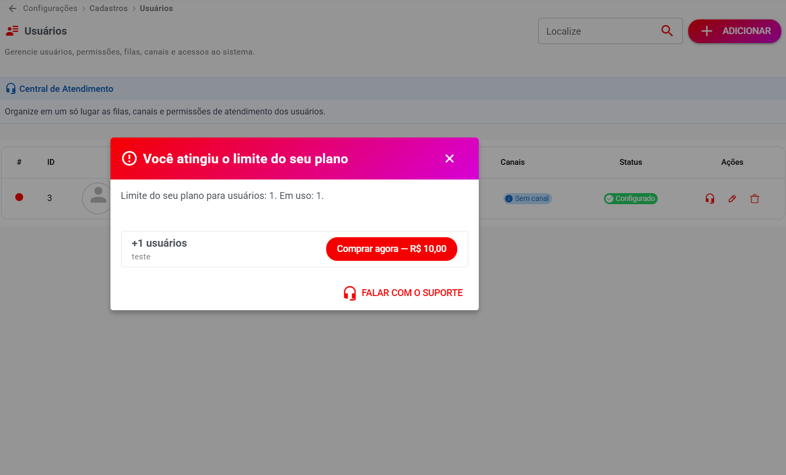
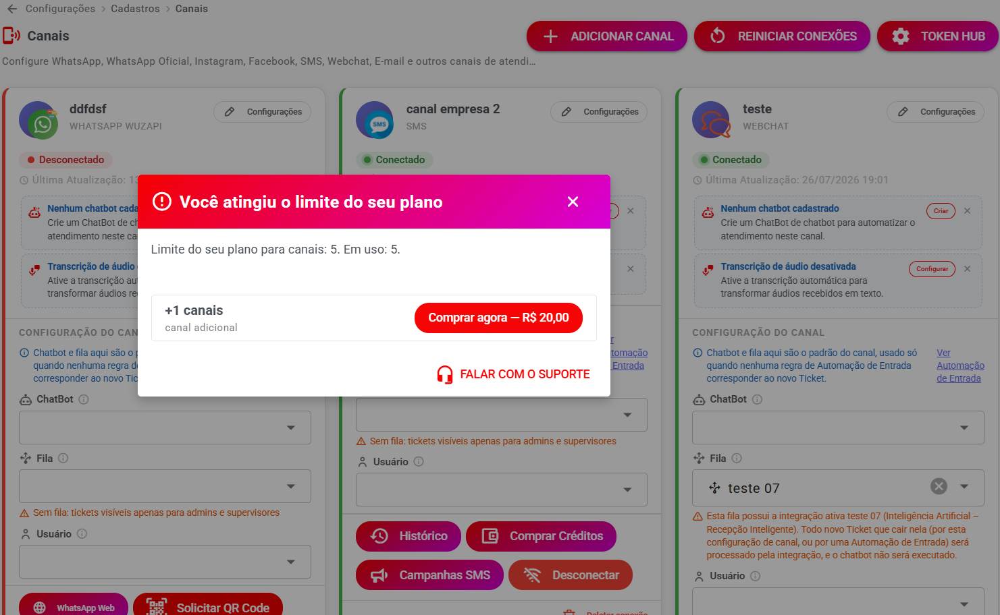
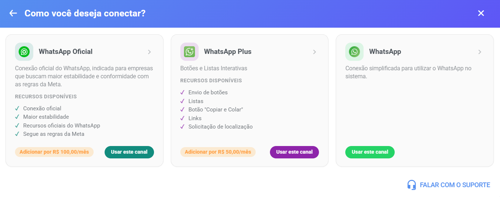
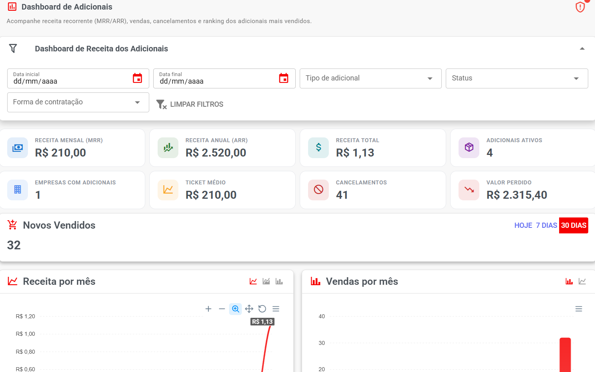

# 🛒 Adicionais

> **Disponível a partir da versão 3.0**

A partir da versão **3.0**, o Whazing permite que o SaaS venda diversos recursos como **adicionais**, sem precisar obrigar o cliente a trocar de plano.

Os adicionais podem aumentar limites do plano ou simplesmente representar um serviço contratado separadamente.

Essa funcionalidade permite criar uma estrutura de venda mais flexível.

Por exemplo, o cliente pode ter:

**Plano Premium**

e contratar separadamente:

* +2 Usuários
* +1 Canal
* +10 GB de armazenamento
* +1 WaCalls
* +5.000 requisições de Copilot
* +10.000 requisições de Smart Reception

***

## 🎯 O que são adicionais?

Um adicional é um recurso ou serviço comprado separadamente pelo cliente.

Imagine que o plano do cliente tenha:

**5 usuários**

Mas a empresa precisa de mais usuários.

Em vez de mudar de plano, o cliente pode comprar:

**+2 Usuários**

O novo limite passa a ser:

**5 do plano + 2 adicionais = 7 usuários**

***

## 📍 Onde o administrador cria os adicionais?

No Painel SaaS, acesse:

**Painel SaaS → Comercial → Adicionais**

Nessa tela você pode criar, editar, ativar ou desativar os adicionais disponíveis para os clientes.

<figure><figcaption></figcaption></figure>

***

## 📦 Tipos de adicionais

O sistema permite trabalhar com diferentes tipos de adicionais.

Entre os exemplos estão:

* **Usuários**
* **Canais**
* **WaCalls**
* **Armazenamento (GB)**
* **Campanhas WhatsApp**
* **Campanhas Oficial (Meta)**
* **Campanhas Email**
* **Campanhas SMS**
* **Integrações**
* **Serviço avulso / externo**
* **Copilot**
* **Smart Reception**
* **Embeddings**
* **Resposta automática em redes sociais**

Cada tipo possui uma finalidade diferente.

> 💡 **Novidade:** além dos tipos listados acima, existem os **adicionais específicos por tipo de canal** — **WhatsApp Plus**, **WhatsApp Oficial (WABA)**, **Instagram** e **Facebook** — que permitem cobrar valores diferentes por tipo. Veja a seção [📱 Adicionais por tipo de canal](adicionais.md#adicionais-por-tipo-de-canal) mais abaixo.

***

## 👥 1. Usuários

O adicional **Usuários** aumenta a quantidade de usuários que a empresa pode cadastrar.

#### Exemplo

Plano:

**5 usuários**

Adicional:

**+2 usuários**

Total:

**7 usuários**

***

## 🛒 Como o cliente compra usuários?

Quando a empresa atingir o limite de usuários do plano, o sistema pode apresentar a possibilidade de contratar um adicional.

Exemplo:

> ⚠️ Seu plano atingiu o limite de usuários.

O cliente poderá acessar a opção de contratação do adicional.

Depois da compra:

**Limite do plano + quantidade adicional**

<figure><figcaption></figcaption></figure>

***

## 📱 2. Canais

O adicional **Canais** permite aumentar a quantidade de canais que uma empresa pode utilizar.

Exemplo:

Plano:

**2 canais**

Adicional:

**+1 canal**

Novo limite:

**3 canais**

> 💡 Este é o adicional **genérico** de canais. Para vender canais com **valores diferentes por tipo** (WhatsApp Plus, WhatsApp Oficial, Instagram, Facebook), veja a seção [📱 Adicionais por tipo de canal](adicionais.md#adicionais-por-tipo-de-canal) abaixo.

***

## 🛒 Compra de canal

Quando o cliente tentar adicionar um canal e o limite do plano já estiver ocupado, o sistema apresenta a contratação **direto no catálogo de canais**.

O catálogo que abre na tela de **Canais** já mostra, em cada canal, um aviso sobre a disponibilidade:

* **"Usar este canal"** — há vaga no plano, conecta sem custo extra;
* **"Adicionar por R$ X/mês"** — o limite do tipo acabou, e o adicional é oferecido na hora;
* **"É necessário aumentar seu limite de canais"** — o limite geral do plano acabou;
* **"Não disponível no seu plano"** — o tipo não está habilitado no plano do cliente.

Se faltarem **dois limites ao mesmo tempo** (limite do tipo **e** limite geral), o sistema junta os dois itens em **uma única fatura** na mesma tela de compra.

O pagamento acontece no próprio fluxo — **PIX** (QR Code ou copiar e colar), **link de pagamento** ou **chave PIX manual** para valores maiores. A ativação do canal segue a configuração do adicional: liberado **na hora** (com pagamento a finalizar) ou **após a confirmação do pagamento**. Em ambos os casos, a configuração do canal **continua automaticamente** de onde parou.

> 🎬 O guia completo do cliente, com o passo a passo das telas, está em:
>
> [**Canais Adicionais (venda aos seus clientes)**](adicionais-de-canais.md)

<figure><figcaption></figcaption></figure>

***

## 📱 Adicionais por tipo de canal

Além do adicional genérico de **Canais**, o sistema permite criar adicionais **específicos para um tipo de canal**, cada um com **valor próprio definido por você** — é a sua oferta de canais para os seus clientes.

* **WhatsApp Plus** — WhatsApp com botões e listas interativas
* **WhatsApp Oficial (WABA)** — conexão oficial do WhatsApp
* **Instagram**
* **Facebook**

**Exemplo comercial:** o plano inclui 3 canais gerais, mas você quer cobrar um valor diferente por cada WhatsApp Oficial. Você cria um adicional do tipo **WhatsApp Oficial (WABA)** com o valor desejado, e outro do tipo **WhatsApp Plus** com outro valor. O cliente contrata somente o tipo que precisa, pelo preço que você definiu.

> 💡 **É a sua venda:** o adicional é criado no seu Painel SaaS, com o seu preço, e a cobrança entra no seu financeiro. O cliente contrata o que **você** disponibilizou.

<figure><figcaption></figcaption></figure>

### 🏷️ Como criar

O caminho é o mesmo de qualquer adicional (**Painel SaaS → Comercial → Adicionais → Criar Adicional**), escolhendo no campo **Tipo** uma das opções de canal específico.

Ao escolher um tipo de canal, o sistema mostra a dica na própria tela:

> _"Este adicional libera canais extras somente deste tipo. Só terá efeito em planos com esse tipo de canal habilitado e 'Ativar limite de canais por tipo' ligado — mesmo que a quantidade inclusa seja 0. Caso contrário, use o adicional geral de Canais."_

### ⚠️ Requisito no plano

Para o adicional de um tipo de canal funcionar, o plano da empresa precisa de **duas coisas**:

1. O **tipo de canal habilitado** no plano (seção **Canais Disponíveis**);
2. A opção **"Ativar limite de canais por tipo"** **ligada** no plano.

Se faltar um dos dois, o sistema **avisa na criação do adicional**:

> _"Este adicional não terá efeito nos planos selecionados a seguir, pois eles não têm este tipo de canal habilitado ou não têm 'Ativar limite de canais por tipo' ligado: {planos}."_

> 💡 **Quantidade inclusa = 0 é um valor válido!** Significa que o plano não inclui nenhum canal daquele tipo de graça — o cliente compra todos por adicional. Isso é um modelo comum para vender, por exemplo, WhatsApp Oficial sempre como adicional.

### 💳 Como o cliente compra

O cliente contrata pelos mesmos lugares de sempre: no **catálogo de canais** ao adicionar um canal (o card do canal mostra **"Adicionar por R$ X/mês"**) ou na seção **"Canais adicionais"** do **Financeiro** (um card por tipo, com preço e quantidade contratada).

Detalhes que valem destacar:

* A compra do tipo específico cobre o **limite daquele tipo**; se o **limite geral** do plano também estiver no teto, os dois itens entram na **mesma fatura** automaticamente;
* O comportamento de liberação segue o campo **"Exigir pagamento antes de liberar"** do adicional (na hora ou após a confirmação do pagamento);
* Tipos de canal **sem adicional cadastrado** aparecem para o cliente como **"Não disponível no seu plano"**.

O passo a passo completo das telas do cliente está em:

[**Canais Adicionais (venda aos seus clientes)**](adicionais-de-canais.md)

***

## 📞 3. WaCalls

O adicional **WaCalls** permite vender acessos ao serviço de chamadas de voz.

Exemplo:

**+1 WaCalls**

O cliente compra o adicional e o serviço pode ser ativado automaticamente conforme a configuração do SaaS.

**Automação e Integrações → Chamadas de Voz (WaCalls)**

***

## 💾 4. Armazenamento (GB)

O adicional **Armazenamento (GB)** aumenta o espaço disponível para a empresa.

Exemplo:

Plano:

**10 GB**

Adicional:

**+5 GB**

Total:

**15 GB**

Esse tipo de adicional é especialmente útil quando a empresa está próxima de atingir ou já ultrapassou seu limite de armazenamento.

***

## 📢 5. Campanhas WhatsApp

Liberar envio de campanhas api não oficial

***

## 📢 6. Campanhas Oficial (Meta)

Liberar envio de campanhas api oficial

***

## 📧 7. Campanhas Email

Liberar envio de campanhas por email

***

## 📱 8. Campanhas SMS

Liberar envio de campanhas SMS

***

## 🔌 9. Integrações

Libera acesso integrações

***

## 🧾 10. Serviço avulso / externo

Esse tipo possui uma característica diferente.

O **Serviço avulso / externo** serve para gerar uma cobrança, **sem alterar nenhum limite ou recurso do sistema**.

Ou seja, ele funciona como um produto comercial.

#### Exemplos

* Hospedagem N8N
* Domínio
* Consultoria
* Suporte Premium
* Serviço externo
* Configuração personalizada
* Serviço técnico

#### Exemplo

Você pode criar:

**Hospedagem N8N**

Valor:

**R$ 49,90/mês**

Ao contratar, o cliente terá a cobrança do serviço, mas o sistema não aumenta:

* Número de usuários
* Número de canais
* Armazenamento
* Campanhas
* Recursos de IA

É simplesmente um serviço contratado.

> 💡 Esse tipo é útil para transformar outros serviços oferecidos pelo SaaS em cobranças recorrentes dentro do mesmo sistema financeiro.

***

## 🤖 11. Copilot

O adicional **Copilot** permite vender utilização adicional do assistente de IA.

Exemplo:

Plano:

**10.000 tokens**

Adicional:

**+50.000 tokens**

O cliente passa a ter:

**60.000 tokens**

conforme as regras de consumo configuradas.

O cliente encontra os serviços de IA em:

**Automação e Integrações → Serviços de IA**

***

## 🤖 12. Smart Reception

O **Smart Reception** pode ser vendido como adicional de utilização.

Exemplo:

Plano:

**1.000 requisições**

Adicional:

**+500 requisições**

O cliente passa a ter uma capacidade adicional para o recurso.

***

## 🧠 13. Embeddings

O adicional **Embeddings** permite disponibilizar uma quantidade adicional de utilização desse recurso de IA.

O cliente poderá acompanhar o serviço em:

**Automação e Integrações → Serviços de IA**

***

## 📱 14. Resposta automática em redes sociais

Também é possível criar adicionais para:

**Resposta automática em redes sociais**

Isso permite aumentar a utilização desse recurso de IA além do limite incluído no plano.

***

## ⚙️ Como criar um adicional?

Acesse:

**Painel SaaS → Comercial → Adicionais**

Clique em:

**Criar Adicional**

A tela possui campos como:

* Nome
* Descrição
* Tipo
* Quantidade
* Valor mensal
* Tipo de contratação
* Valor mínimo de cobrança proporcional
* Planos disponíveis
* Ativo
* Disponível para Trial
* Exigir pagamento antes de liberar

***

## 📝 Nome

Escolha um nome fácil de entender.

Exemplos:

**+1 Usuário**

**+1 Canal**

**+5 GB**

**+1 WaCalls**

**+50.000 Tokens Copilot**

**Hospedagem N8N**

***

## 📄 Descrição

Explique o que o cliente está comprando.

Exemplo:

> Adicione mais um usuário à sua empresa.

Ou:

> Adicione 5 GB de armazenamento ao seu plano.

Para serviço externo:

> Hospedagem gerenciada do N8N.

***

## 🏷️ Tipo

Escolha o tipo correspondente ao que está sendo vendido.

Exemplo:

```
Nome:
+5 GB

Tipo:
Armazenamento (GB)
```

***

## 🔢 Quantidade

Informe quanto será adicionado.

Exemplos:

**Usuários**

```
1
```

**Armazenamento**

```
5
```

**Canais**

```
1
```

**WaCalls**

```
1
```

***

## 💰 Valor mensal

Informe quanto o cliente pagará pelo adicional.

Exemplo:

```
R$ 29,90
```

A cobrança pode ser recorrente conforme a configuração do adicional.

***

## 🛒 Compra pelo cliente

Quando o adicional estiver configurado como:

**Compra pelo cliente**

o próprio cliente poderá contratá-lo.

Isso é importante para criar um modelo de **autosserviço**.

O cliente não precisa abrir chamado para solicitar o aumento do limite.

***

## 🔐 Serviço privado

Também é possível utilizar o adicional como serviço privado, vinculado somente pelo administrador do SaaS.

Isso pode ser útil quando o serviço não deve aparecer para todos os clientes.

***

## 💵 Valor mínimo de cobrança proporcional

Informe o valor mínimo utilizado quando o cálculo proporcional gerar um valor muito baixo.

Exemplo:

**R$ 5,00**

Esse recurso é útil porque algumas plataformas de pagamento possuem valores mínimos para cobranças.

***

## 📋 Planos disponíveis

Selecione quais planos poderão contratar o adicional.

Por exemplo:

**+1 Canal**

Disponível para:

* Premium
* Empresarial

Não disponível para:

* Gratuito

***

## ✅ Ativo

Ative para disponibilizar o adicional.

Se estiver desativado, ele não ficará disponível para novas contratações.

***

## 🧪 Disponível para Trial

Permite determinar se o adicional poderá ser utilizado durante o período de teste.

Use de acordo com sua estratégia comercial.

***

## 💳 Exigir pagamento antes de liberar

Quando ativado, o adicional só será liberado após a confirmação do pagamento.

Fluxo:

```
Cliente solicita adicional
        ↓
Pagamento
        ↓
Pagamento confirmado
        ↓
Adicional liberado
```

***

## 👤 Como o cliente encontra os adicionais?

O cliente não precisa acessar o Painel SaaS.

Os adicionais aparecem nos locais relacionados ao recurso.

Isso deixa a experiência mais simples para usuários leigos.

***

## 📱 Exemplo: adicional de usuários

Quando o cliente tentar adicionar um usuário e estiver fora do limite:

```
Limite de usuários atingido
        ↓
Sistema identifica adicional disponível
        ↓
Cliente pode contratar
```

Depois da contratação, o novo limite fica disponível.

***

## 📡 Exemplo: adicional de canais

Quando o cliente tentar cadastrar um canal além do limite:

```
Limite de canais atingido
        ↓
Adicional disponível
        ↓
Cliente contrata
        ↓
Novo limite liberado
```

***

## 📢 Exemplo: campanhas

Para campanhas, o cliente encontra a opção nas próprias telas de campanha.

Dependendo do tipo:

* Campanhas WhatsApp
* Campanhas Oficial (Meta)
* Campanhas Email
* Campanhas SMS

***

## 🤖 Exemplo: IA

Os adicionais de IA possuem uma área específica para o cliente:

**Automação e Integrações → Serviços de IA**

Nessa tela o cliente consegue acompanhar:

* Serviço
* Status
* Limite mensal
* Consumo atual
* Origem
* Próxima renovação
* Adicionais disponíveis

Exemplo:

#### Smart Reception

**Ativo**

Limite mensal:

**1.000 requisições**

Consumo atual:

**950 requisições**

Isso permite ao cliente perceber que está próximo do limite.

***

## ⚠️ 15. Avisos quando o limite está próximo

Uma das vantagens dos adicionais é permitir que o cliente seja informado antes de ficar sem capacidade.

Exemplo:

```
⚠️ Você está próximo do limite contratado.

Consumo:
950 / 1.000

[Contratar adicional]
```

Esse tipo de aviso ajuda o cliente a tomar uma decisão antes que o limite seja atingido.

***

## 🚨 16. Quando o limite é atingido

Quando o cliente chega ao limite, o sistema pode informar:

```
⚠️ Limite atingido.

Você atingiu o limite disponível no seu plano.

[Contratar adicional]
```

O cliente poderá contratar o adicional disponível para continuar utilizando o recurso, quando aplicável.

***

## 📊 Dashboard de Adicionais

O administrador possui um relatório próprio para acompanhar os adicionais.

Acesse:

**Painel SaaS → Comercial → Dashboard de Adicionais**

Essa tela ajuda a acompanhar as vendas e utilização dos adicionais.

<figure><figcaption></figcaption></figure>

***

## 📈 O que acompanhar no Dashboard?

Utilize o Dashboard para acompanhar informações como:

* Quantidade de adicionais contratados
* Empresas que contrataram
* Adicionais mais vendidos
* Receita gerada
* Evolução das contratações
* Serviços com maior procura

> 💡 Esse painel é especialmente útil para descobrir quais recursos seus clientes estão mais interessados em comprar.

***

## 💰 Estratégia comercial

Os adicionais permitem criar uma estratégia de **upsell**.

Em vez de obrigar o cliente a mudar de plano:

```
Plano Premium
       ↓
Cliente precisa de mais usuários
       ↓
+2 Usuários
       ↓
Pagamento adicional
```

Outro exemplo:

```
Plano Premium
       ↓
Cliente precisa de mais armazenamento
       ↓
+10 GB
       ↓
Pagamento adicional
```

E:

```
Plano Premium
       ↓
Cliente quer IA
       ↓
+50.000 Tokens Copilot
       ↓
Pagamento adicional
```

***

## 🧠 Dica para montar os adicionais

Evite criar somente um pacote.

Por exemplo, para armazenamento, você pode oferecer:

| Adicional |      Exemplo |
| --------- | -----------: |
| +1 GB     |  R$ 1,00/mês |
| +5 GB     |  R$ 4,00/mês |
| +10 GB    |  R$ 7,00/mês |
| +50 GB    | R$ 25,00/mês |

Os valores são apenas exemplos.

A ideia é oferecer opções pequenas e maiores para diferentes necessidades.

***

## 🏷️ Exemplos de catálogo de adicionais

Você pode montar um catálogo semelhante a:

#### 👥 Usuários

**+1 usuário**

**+5 usuários**

***

#### 📱 Canais

**+1 canal**

**+3 canais**

***

#### 💾 Armazenamento

**+1 GB**

**+10 GB**

**+50 GB**

***

#### 📞 WaCalls

**+1 WaCalls**

***

#### 🤖 Inteligência Artificial

**+10.000 tokens Copilot**

**+500 Smart Reception**

**+500 Embeddings**

**+500 respostas automáticas**

***

#### 🔌 Serviços

**Hospedagem N8N**

**Domínio**

**Consultoria**

**Suporte Premium**

***

## 🔄 Como funciona para o cliente?

O fluxo geral é:

```
Cliente utiliza o sistema
        ↓
Chega perto do limite
        ↓
Sistema informa
        ↓
Cliente vê adicional disponível
        ↓
Cliente contrata
        ↓
Pagamento confirmado
        ↓
Adicional liberado
        ↓
Novo limite disponível
```

***

## ❓ Perguntas frequentes

#### O adicional substitui o plano?

Não. O adicional é contratado separadamente e complementa o plano.

#### Posso vender usuários adicionais?

Sim.

#### Posso vender canais adicionais?

Sim.

#### Posso vender armazenamento?

Sim. Utilize o tipo **Armazenamento (GB)**.

#### Posso vender WaCalls?

Sim. Utilize o tipo **WaCalls**.

#### Posso vender IA?

Sim. Existem tipos específicos para:

* Copilot
* Smart Reception
* Embeddings
* Resposta automática em redes sociais

#### Posso vender serviços que não alteram nenhum limite?

Sim. Utilize **Serviço avulso / externo**.

#### O cliente precisa entrar em contato com o suporte?

Não necessariamente. Quando o adicional estiver configurado como **Compra pelo cliente**, ele poderá contratar diretamente pelo sistema.

#### Posso disponibilizar um adicional somente para alguns planos?

Sim. Utilize **Planos disponíveis**.

#### Posso exigir pagamento antes de liberar?

Sim. Ative **Exigir pagamento antes de liberar**.

#### Onde acompanho as vendas?

No:

**Painel SaaS → Comercial → Dashboard de Adicionais**

#### O cliente consegue saber quando está perto do limite?

Sim. Nas áreas correspondentes ao recurso, o sistema pode informar quando o consumo está próximo ou quando o limite foi atingido.

***

## ✅ Checklist do administrador

Antes de liberar um adicional para os clientes:

* [ ] Criar o adicional
* [ ] Escolher o tipo correto
* [ ] Definir a quantidade
* [ ] Definir o valor mensal
* [ ] Escolher entre compra pelo cliente ou serviço privado
* [ ] Definir valor mínimo proporcional
* [ ] Selecionar os planos disponíveis
* [ ] Ativar o adicional
* [ ] Definir se estará disponível para Trial
* [ ] Definir se exige pagamento antes da liberação
* [ ] Fazer um teste com uma empresa
* [ ] Confirmar a cobrança
* [ ] Confirmar a liberação do adicional
* [ ] Confirmar o novo limite
* [ ] Conferir o resultado no Dashboard de Adicionais

> 🎉 **Pronto!** A partir da versão 3.0, os adicionais permitem transformar praticamente qualquer recurso comercializável do SaaS em uma oportunidade de **upsell**, permitindo que o cliente aumente sua capacidade quando precisar, sem necessariamente trocar de plano.
