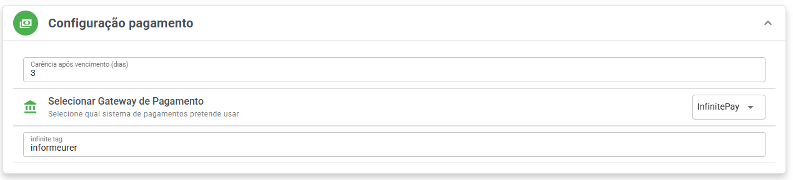

# Gateways pagamentos

### Carência após vencimento

#### O que é?

Painel SaaS do Whazing conta com a configuração **"Carência após vencimento"**.

Essa opção permite definir uma quantidade de dias em que o cliente poderá continuar utilizando o sistema mesmo após o vencimento da assinatura.

Ideal para situações como:

* Compensação de boletos bancários
* Atrasos em transferências Pix
* Finais de semana e feriados
* Evitar bloqueios imediatos por pequenos atrasos

***

#### Como funciona?

Ao configurar uma quantidade de dias de carência:

* O cliente continua acessando normalmente após o vencimento
* O bloqueio só acontece após finalizar o período definido
* Caso o pagamento seja identificado dentro da carência, o acesso permanece ativo sem interrupções

***

#### Exemplo

* Vencimento da assinatura: **10/05**
* Carência configurada: **3 dias**

O cliente poderá continuar utilizando o sistema até **13/05**.

***

#### Onde configurar?

No painel SaaS:

**Configurações → Configuração pagamento → Carência após vencimento**

Defina a quantidade de dias desejada.

<figure><figcaption></figcaption></figure>

***

### 💸 Pushin Pay no Whazing

Cada transação Pix possui taxa fixa de apenas **R$ 0,30**\
Valor definitivo — não é promoção.

👉 Cadastre-se agora:\
[https://pushinpay.whazing.com.br](https://pushinpay.whazing.com.br)

***

No Whazing você pode receber pagamentos via:\
✅ [Pushin Pay (Pix R$ 0,30 fixo)](configurar-pushin-pay.md)\
✅ [Mercado Pago](configurar-mercado-pago.md)\
✅ [Asaas](configurar-asaas.md)\
✅ [Efi](configurar-efi-bank.md)\
✅ [InfinitePay](infinitepay.md)\
✅ Stripe
