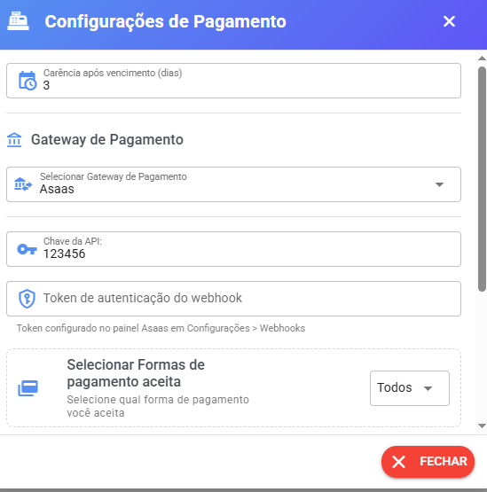

# Gateways de Pagamento

## 📊 Receitas

No **Painel SaaS**, acesse:

**Painel SaaS → Comercial → Receitas**

Essa tela permite acompanhar faturas, pagamentos e cobranças das empresas.

### Filtros

A tela de Receitas possui filtros para facilitar a busca:

* **Data Inicial** / **Data Final**
* **Status** — Todas, Pagas, Pendentes, Vencidas, Canceladas etc.
* **Empresa**
* **Buscar Invoice** — por número ou descrição
* **Valor Mínimo** (R$)
* **Valor Máximo** (R$)

### Indicadores

No topo da tela são exibidos os principais indicadores:

* **Faturamento Total**
* **Total Recebido**
* **Total em Aberto**
* **Total Vencido**
* **Total de Invoices**
* **Invoices Pagas**
* **Invoices Pendentes**
* **Invoices Vencidas**
* **Ticket Médio**

### Lista de Invoices

A tela apresenta a lista de invoices com as seguintes informações:

* Número da invoice
* Empresa (nome e e-mail)
* Descrição — plano, adicional, serviço avulso etc.
* Valor
* Data
* Status (Paga, Pendente, Vencida, Cancelada)
* Vencimento

A lista possui paginação (**Registros por página**).

***

## ⚙️ Configurações de Pagamento

Ainda em **Comercial → Receitas**, o modal **Configurações de Pagamento** reúne todas as configurações de cobrança do SaaS.

### Carência após vencimento (dias)

#### O que é?

A configuração **"Carência após vencimento"** permite definir uma quantidade de dias em que o cliente poderá continuar utilizando o sistema mesmo após o vencimento da assinatura.

Ideal para situações como:

* Compensação de boletos bancários
* Atrasos em transferências Pix
* Finais de semana e feriados
* Evitar bloqueios imediatos por pequenos atrasos

#### Como funciona?

Ao configurar uma quantidade de dias de carência:

* O cliente continua acessando normalmente após o vencimento
* O bloqueio só acontece após finalizar o período definido
* Caso o pagamento seja identificado dentro da carência, o acesso permanece ativo sem interrupções

#### Exemplo

* Vencimento da assinatura: **10/05**
* Carência configurada: **3 dias**

O cliente poderá continuar utilizando o sistema até **13/05**.

#### Onde configurar?

No painel SaaS:

**Painel SaaS → Comercial → Receitas → Configurações de Pagamento**

Defina a quantidade de dias desejada no campo **Carência após vencimento (dias)**.

<figure><figcaption></figcaption></figure>

***

### Gateway de Pagamento

No modal **Configurações de Pagamento**, no campo **Gateway de Pagamento**, selecione qual gateway será utilizado para receber os pagamentos:

* **InfinitePay**
* **Pushinpay - Pix taxa especial**
* **Mercado Pago**
* **Asaas**
* **EFI Bank**
* **Stripe**

Cada gateway possui seus próprios campos de configuração (chaves, tokens, certificados) e requer a configuração do **webhook** para que os pagamentos sejam baixados automaticamente.

> 💡 Todos os gateways possuem **Carência após vencimento (dias)** e as demais configurações no mesmo modal.

***

### 💸 Pushin Pay no Whazing

Cada transação Pix possui taxa fixa de apenas **R$ 0,30**\
Valor definitivo — não é promoção.

👉 Cadastre-se agora:\
[https://pushinpay.whazing.com.br](https://pushinpay.whazing.com.br)

***

No Whazing você pode receber pagamentos via:\
✅ [InfinitePay](infinitepay.md)\
✅ [Pushin Pay (Pix R$ 0,30 fixo)](configurar-pushin-pay.md)\
✅ [Mercado Pago](configurar-mercado-pago.md)\
✅ [Asaas](configurar-asaas.md)\
✅ [EFI Bank](configurar-efi-bank.md)\
✅ [Stripe](stripe.md)
