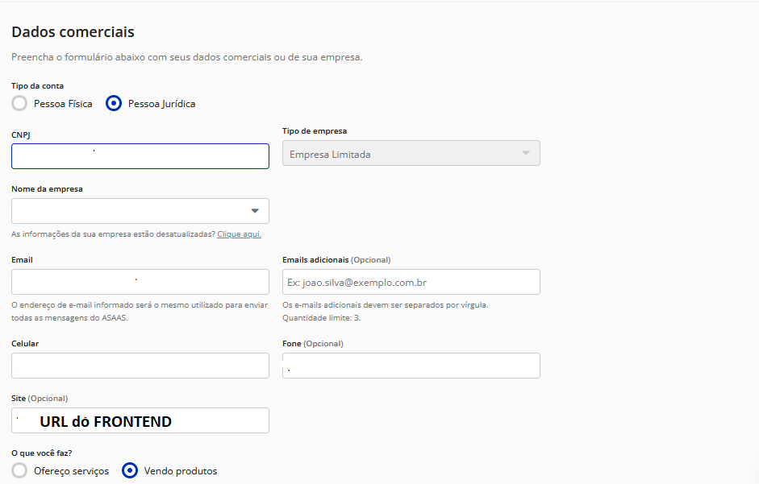

# Asaas

### 🎁 Ganhe R$ 50 de Bônus no Asaas

Ainda não possui conta no Asaas?

Cadastre-se através do nosso link de indicação e receba **R$ 50,00 de bônus** para utilizar na plataforma:

👉 [https://www.asaas.com/r/MJVUJPJY](https://www.asaas.com/r/MJVUJPJY)

Após criar sua conta, siga o guia de configuração abaixo para integrar o Asaas ao Whazing.

### 1️⃣ Acessar a Página de Integrações

* Entre no site do Asaas e vá até a página de integrações pelo link abaixo:\
  🔗 [**Página de Integrações Asaas**](https://www.asaas.com/customerConfigIntegrations/index)

### 2️⃣ Copiar a Chave da API

* Na página de integrações, localize a **Chave da API**.
* Copie essa chave, pois ela será necessária para configurar no painel do Whazing.

### 3️⃣ Criar um Webhook

* No painel do Whazing, siga as instruções para configurar um **Webhook** corretamente.
* O Webhook é necessário para que o Asaas envie notificações automáticas sobre pagamentos.

### 4️⃣ Configurar as Informações da Conta

* Acesse a página de configurações da sua conta no Asaas pelo link:\
  🔗 [**Configurações da Conta**](https://www.asaas.com/config/index)

### 5️⃣ Adicionar a URL do Seu Site

* No campo **"Site (Opcional)"**, coloque o endereço do seu frontend (o site ou sistema que você usa para gerenciar os dados).

📌 **Pronto!** Agora seu sistema está configurado para funcionar com o Asaas e o Whazing.

> 🖼️ **Exemplo:** Veja a imagem abaixo para referência:\
> 
