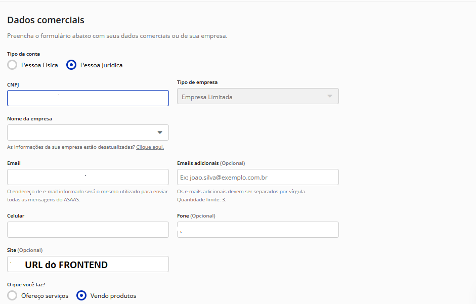

# Asaas

### 🎁 Ganhe R$ 50 de Bônus no Asaas

Ainda não possui conta no Asaas?

Cadastre-se através do nosso link de indicação e receba **R$ 50,00 de bônus** para utilizar na plataforma:

👉 [https://www.asaas.com/r/MJVUJPJY](https://www.asaas.com/r/MJVUJPJY)

Após criar sua conta, siga o guia de configuração abaixo para integrar o Asaas ao Whazing.

***

### 1️⃣ Acessar a Página de Integrações

* Entre no site do Asaas e vá até a página de integrações pelo link abaixo:\
  🔗 [**Página de Integrações Asaas**](https://www.asaas.com/customerConfigIntegrations/index)

### 2️⃣ Copiar a Chave da API

* Na página de integrações, localize a **Chave da API**.
* Copie essa chave, pois ela será necessária para configurar no painel do Whazing.

***

### 3️⃣ Configurar no PAINEL SaaS

No Whazing:

1. Acesse **Painel SaaS → Comercial → Receitas**
2. Em **Configurações de Pagamento**, no campo **Gateway de Pagamento**, selecione **Asaas**
3. Preencha a **Chave da API**
4. No campo **Token de autenticação do webhook**, informe o token criado no painel do Asaas em **Configurações > Webhooks**
5. Em **Selecionar Formas de pagamento aceita**, escolha as formas de pagamento que você aceita (ex.: **Todos**)

***

### 4️⃣ Configurar o Webhook no Asaas

O Webhook é necessário para que o Asaas envie notificações automáticas sobre pagamentos.

No painel do Asaas, acesse **Integrações → Webhooks → Adicionar Webhook** e preencha:

* **Este Webhook ficará ativo?** — **Sim**
* **URL do Webhook** — informe a URL do seu backend:

```
https://SEU-BACKEND/subscription/payment/webhook/
```

> 💡 A URL é a do seu backend Whazing. Exemplo: `https://bottesteapi2.whazing.com.br/subscription/payment/webhook/`

* **E-mail** — seu e-mail
* **Versão da API** — **V3**
* **Fila de sincronização ativada?** — **Sim**
* **Tipo de envio** — **Sequencial**
* **Adicionar Eventos** — em **Cobranças**, marque:
  * **PAYMENT_CONFIRMED**
  * **PAYMENT_RECEIVED**

***

### 5️⃣ Configurar as Informações da Conta

* Acesse a página de configurações da sua conta no Asaas pelo link:\
  🔗 [**Configurações da Conta**](https://www.asaas.com/config/index)

### 6️⃣ Adicionar a URL do Seu Site

* No campo **"Site (Opcional)"**, coloque o endereço do seu frontend (o site ou sistema que você usa para gerenciar os dados).

📌 **Pronto!** Agora seu sistema está configurado para funcionar com o Asaas e o Whazing.

> 🖼️ **Exemplo:** Veja a imagem abaixo para referência:\
> 
