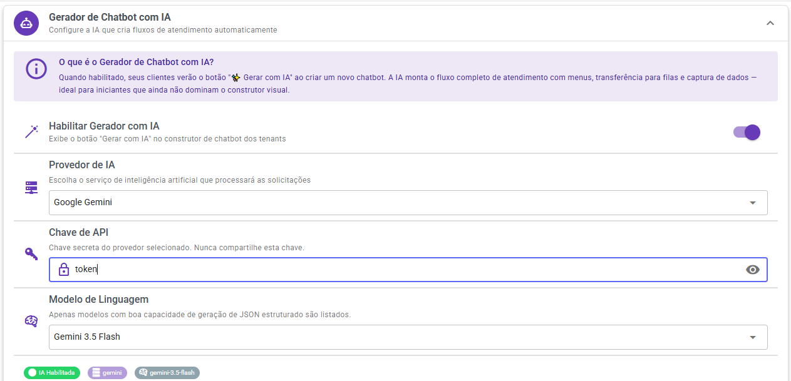
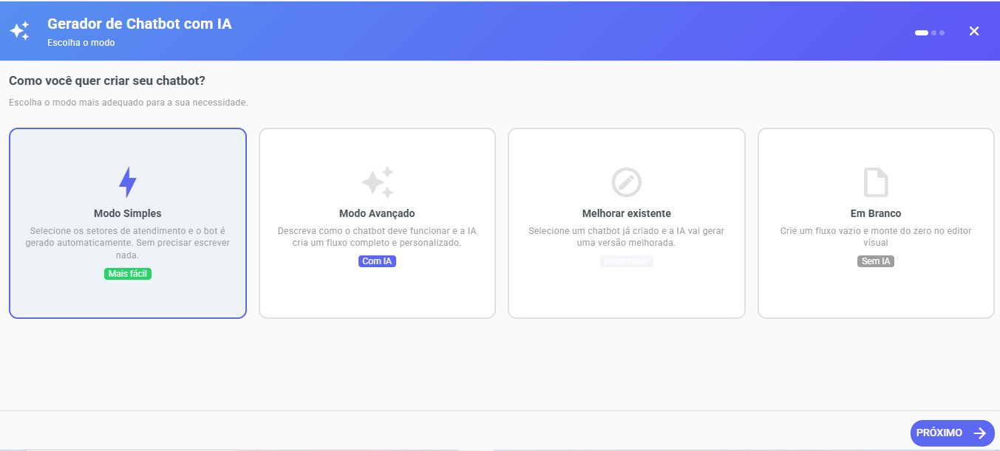
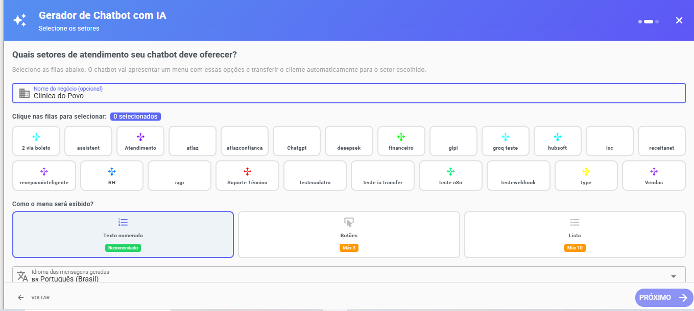
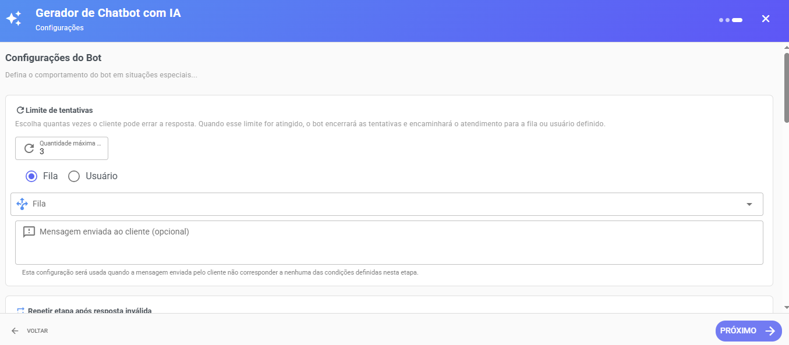
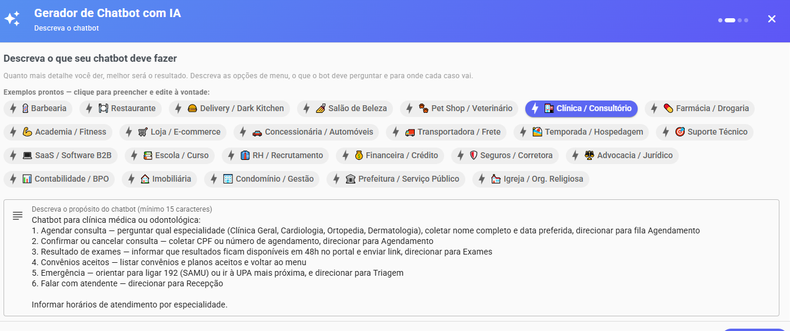
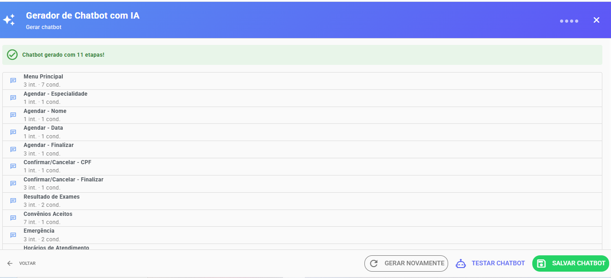
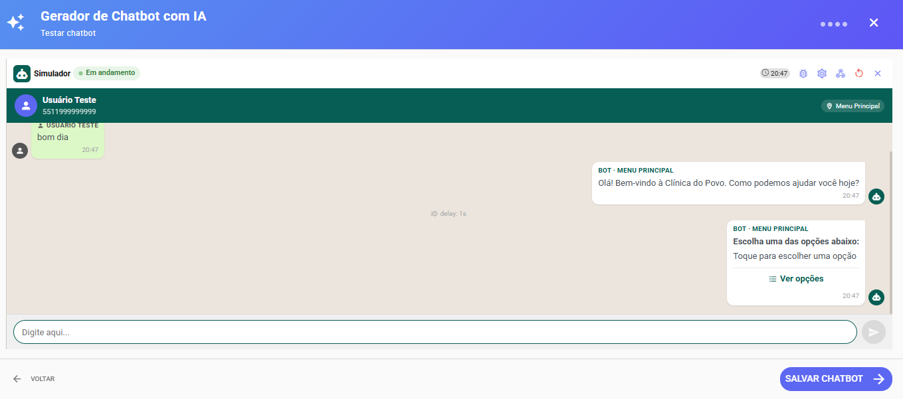

# Gerador de Chatbot com IA

O Gerador de Chatbot com IA permite que seus clientes criem fluxos completos de atendimento automaticamente, reduzindo o tempo de configuração e facilitando a criação de novos chatbots.

A IA é utilizada apenas para gerar o fluxo inicial do chatbot. Após a geração, o fluxo pode ser editado livremente pelo usuário no construtor visual.

> Importante: A IA não será utilizada para responder mensagens dos clientes em canais como WhatsApp, Instagram, Facebook ou Telegram. Ela é usada exclusivamente para gerar a estrutura inicial do chatbot.

***

## Configurando o Gerador de Chatbot com IA

Acesse:

**Painel SaaS → Configurações → Gerador de Chatbot com IA**

Nesta tela estarão disponíveis as seguintes opções:

### Habilitar Gerador com IA

Ative esta opção para permitir que os clientes utilizem a geração automática de chatbots.

<figure><figcaption></figcaption></figure>

***

### Provedor de IA

Selecione o provedor de inteligência artificial que será utilizado para gerar os fluxos.

São suportados:

* OpenAI
* Google Gemini
* Groq
* Provedores compatíveis com OpenAI
* URL Customizada (OpenAI Compatible)

***

### API Key

Informe a chave de API do provedor selecionado.

A chave será utilizada apenas para gerar os fluxos dos chatbots.

***

### Modelo

Selecione o modelo de IA que será utilizado.

#### Modelos gratuitos recomendados

**Gemini 3.5 Flash**

* Gratuito
* Gera bons resultados
* Excelente para criação de fluxos
* Pode ser um pouco mais lento dependendo da demanda

**GPT OSS 120B (Groq)**

* Gratuito
* Muito rápido
* Ótima qualidade para geração de fluxos de atendimento

***

## Custos de utilização

O Gerador de Chatbot com IA normalmente possui um custo muito baixo de utilização.

Isso ocorre porque a IA é usada apenas durante a criação do chatbot e não durante o atendimento dos clientes.

Após gerar o fluxo, o chatbot funciona normalmente sem realizar chamadas constantes para a IA.

Na maioria dos cenários, os modelos gratuitos já atendem perfeitamente à necessidade de geração dos fluxos.

***

## Como os clientes utilizam

Após a configuração pelo administrador SaaS, os clientes verão a opção de criar novos chatbots.

Ao criar um chatbot, existirão modos disponíveis:

<figure><figcaption></figcaption></figure>

### Modo Simples

Não utiliza inteligência artificial.

O usuário apenas:

1. Informa o nome da empresa.
2. Seleciona as filas de atendimento.
3. Escolhe o tipo de menu:
   * Texto
   * Botões
   * Lista
4. Define a ordem de exibição das filas.
5. Configura regras como:
   * Ausência de resposta do cliente
   * Resposta inválida
6. Gera automaticamente um chatbot de encaminhamento para filas.

<figure><figcaption></figcaption></figure>

<figure><figcaption></figcaption></figure>

***

### Modo Avançado

Utiliza inteligência artificial para criar automaticamente um fluxo completo de atendimento.

O usuário informa os dados básicos do negócio e a IA gera:

* Mensagens de boas-vindas
* Menus de atendimento
* Opções para direcionamento
* Encaminhamento para filas
* Estrutura inicial do fluxo

Tem Exemplos prontos para preencher e edite à vontade:

Após a geração, todo o conteúdo pode ser editado livremente no editor visual.

<figure><figcaption></figcaption></figure>

<figure><figcaption></figcaption></figure>

***

## Simulador Integrado

Após gerar o chatbot, é possível testar o fluxo imediatamente utilizando o simulador interno.

O simulador permite validar:

* Navegação entre etapas
* Menus
* Respostas automáticas
* Encaminhamento para filas
* Fluxo completo do atendimento

Isso reduz erros de configuração e facilita a validação antes da publicação.

<figure><figcaption></figcaption></figure>

***

## Benefícios

* Criação de chatbots em poucos segundos.
* Redução do tempo de configuração.
* Menos chamados de suporte.
* Fluxos mais organizados.
* Editor visual para ajustes posteriores.
* Compatível com múltiplos provedores de IA.
* Possibilidade de utilização com modelos gratuitos.
