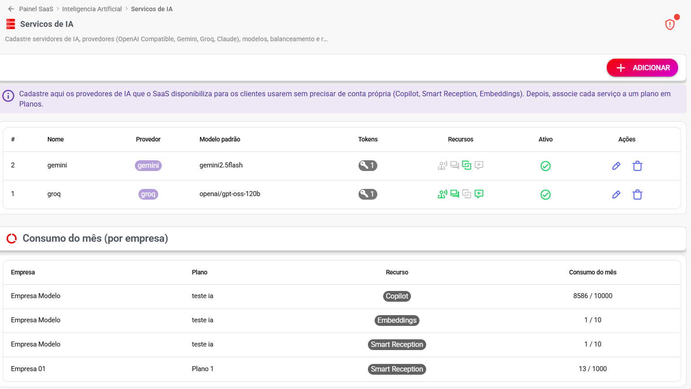
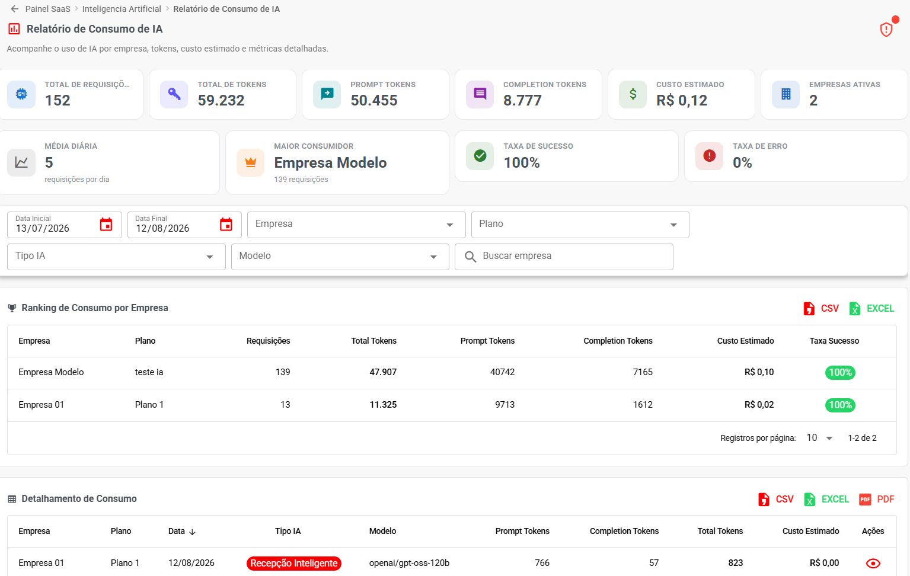
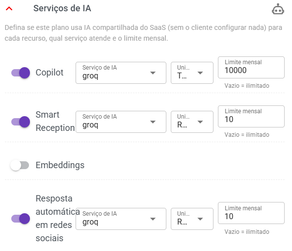
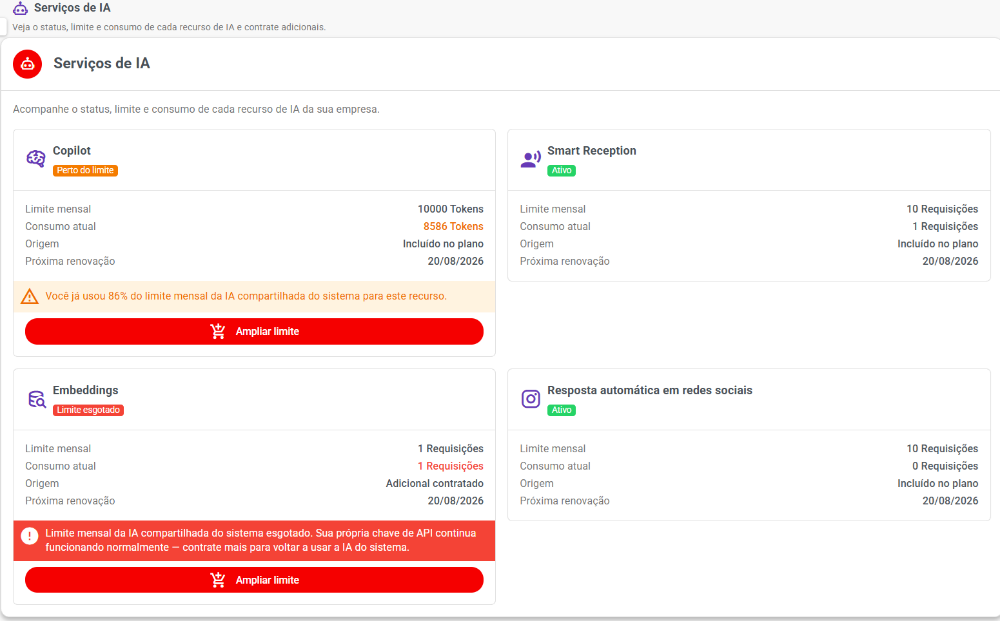
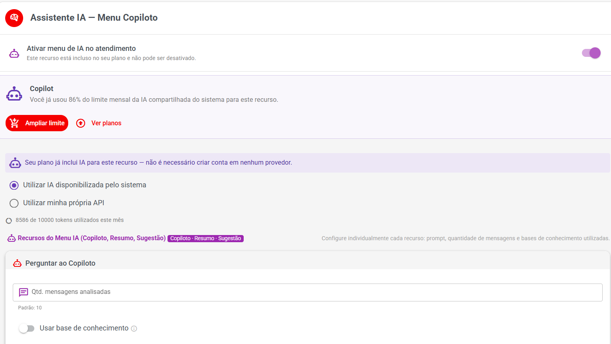

# IA Integrada

> **Disponível a partir da versão 3.0**

A **IA Integrada** permite que o administrador do SaaS disponibilize serviços de Inteligência Artificial para os clientes **sem que eles precisem criar ou configurar uma conta própria em um provedor de IA**.

O administrador do SaaS configura os provedores, modelos e tokens uma única vez. Depois, pode decidir quais recursos estarão disponíveis em cada plano ou vender determinados recursos como **adicionais**.

Entre os recursos que podem utilizar a IA compartilhada estão:

* 🤖 **Copilot**
* 🤖 **Smart Reception**
* 🧠 **Embeddings**
* 📱 **Resposta automática em redes sociais**

> 💡 O cliente pode utilizar a IA disponibilizada pelo SaaS sem precisar informar sua própria chave de API, quando o recurso estiver incluído no plano ou contratado como adicional.

***

## 🔎 Onde configurar?

No **Painel SaaS**, acesse:

**Inteligência Artificial → Serviços de IA**

Nesse local o administrador cadastra os provedores de IA que serão utilizados pelo SaaS.

O fluxo geral é:

**Cadastrar provedor de IA**

⬇️

**Escolher modelo**

⬇️

**Adicionar tokens**

⬇️

**Vincular o serviço ao plano**

⬇️

**Definir limite de utilização**

⬇️

**Cliente utiliza a IA**

⬇️

**SaaS acompanha o consumo**

***

## 🤖 O que são os Serviços de IA?

Os **Serviços de IA** são configurações que permitem ao SaaS utilizar provedores de Inteligência Artificial em nome dos clientes.

Na tela é possível cadastrar servidores/provedores compatíveis com diferentes plataformas, como:

* OpenAI Compatible
* Gemini
* Groq
* Claude

Também é possível configurar:

* URL da API
* Modelo padrão
* Tokens
* Pool de tokens
* Rodízio automático de tokens
* Serviços que poderão utilizar aquele provedor
* Status do serviço

<figure><figcaption></figcaption></figure>

***

## ➕ Criando um Serviço de IA

Acesse:

**Painel SaaS → Inteligência Artificial → Serviços de IA**

Clique em **Novo Serviço de IA**.

Será apresentada a tela de cadastro.

***

### 📝 Nome do serviço

Informe um nome para identificar a configuração.

Exemplo:

**Groq Principal**

ou

**Gemini Produção**

Esse nome é utilizado para identificar o serviço dentro do painel administrativo.

***

## 🔌 Tipo de provedor

Selecione o tipo de provedor utilizado.

Exemplos:

* OpenAI
* OpenAI Compatible
* Gemini
* Groq
* Claude

Dependendo do provedor escolhido, o sistema poderá preencher automaticamente algumas informações.

***

## 🌐 URL Base

A URL Base é o endereço utilizado para acessar a API do provedor.

Por exemplo, para OpenAI:

`https://api.openai.com/v1`

Quando o provedor possui uma URL padrão conhecida, o sistema pode preenchê-la automaticamente.

> 💡 Se estiver utilizando um provedor compatível com a API da OpenAI, utilize a URL fornecida pelo serviço contratado.

***

## 🧠 Modelo padrão

Selecione o modelo que será utilizado pelo serviço.

Exemplos apresentados no sistema podem incluir:

**gemini2.5flash**

ou

**openai/gpt-oss-120b**

O modelo disponível depende do provedor configurado.

> ⚠️ Antes de escolher um modelo, verifique se ele é compatível com o recurso de IA que será utilizado.

***

## ✅ Serviço ativo

Ative essa opção para permitir que o serviço seja utilizado.

Se o serviço estiver desativado, ele não deverá ser utilizado para atender às solicitações dos clientes.

***

## 🎯 Habilitado para

É possível definir quais recursos poderão utilizar aquele serviço.

As opções podem incluir:

#### Copilot

Utilizado pelo assistente de IA disponível no atendimento.

#### Smart Reception

Utilizado pelos recursos de recepção/inteligência automática.

#### Embeddings

Utilizado para recursos que necessitam transformar informações em vetores para busca e conhecimento.

> ⚠️ **Embeddings atualmente são suportados somente com o provedor Gemini.**

#### Resposta automática em redes sociais

Permite utilizar o serviço para recursos de automação de respostas em redes sociais.

***

## 🔄 Pool de tokens — Rodízio automático

O sistema permite cadastrar vários tokens para o mesmo serviço.

Isso é chamado de:

**Pool de tokens (round robin)**

Quando existem vários tokens, o sistema realiza um **rodízio automático** entre eles.

Exemplo:

* Token 1
* Token 2
* Token 3

As requisições podem ser distribuídas:

**Token 1 → Token 2 → Token 3 → Token 1 → Token 2...**

Isso ajuda a distribuir o uso entre os tokens configurados.

***

## 🔑 Adicionando tokens

Na tela do serviço, clique em:

**Adicionar token(s)**

É possível colar:

* Um único token
* Vários tokens separados por vírgula
* Vários tokens em linhas diferentes

O sistema identifica os tokens e realiza o rodízio automaticamente.

***

## 📊 Consumo de IA

O SaaS também possui uma área para acompanhar quanto cada empresa está utilizando dos recursos de IA.

Exemplo:

**Consumo do mês por empresa**

| Empresa                 | Recurso         |        Consumo |
| ----------------------- | --------------- | -------------: |
| Empresa Modelo teste ia | Copilot         | 8.586 / 10.000 |
| Empresa Modelo teste ia | Embeddings      |         1 / 10 |
| Empresa Modelo teste ia | Smart Reception |         1 / 10 |
| Empresa 01              | Smart Reception |     13 / 1.000 |

Isso permite acompanhar o consumo antes que o cliente ultrapasse o limite contratado.

***

## 💰 Relatório de Consumo de IA

Para acompanhar o consumo geral:

**Painel SaaS → Inteligência Artificial → Relatório de Consumo de IA**

Essa tela apresenta informações detalhadas sobre a utilização da IA.

***

### 📈 Indicadores principais

O relatório pode apresentar:

#### Total de Requisições

Quantidade total de chamadas realizadas aos serviços de IA.

#### Total de Tokens

Quantidade total de tokens utilizados.

#### Prompt Tokens

Tokens utilizados nas informações enviadas para o modelo.

#### Completion Tokens

Tokens utilizados na resposta gerada pelo modelo.

#### Custo Estimado

Estimativa do custo gerado pelo consumo de IA.

#### Empresas Ativas

Quantidade de empresas utilizando os serviços.

#### Média Diária

Média de requisições realizadas por dia.

#### Maior Consumidor

Empresa que possui o maior consumo no período selecionado.

#### Taxa de Sucesso

Percentual de requisições processadas com sucesso.

#### Taxa de Erro

Percentual de requisições que apresentaram erro.

***

## 📅 Filtros do relatório

É possível filtrar o período e os dados analisados.

Exemplo:

**Data Inicial:** 13/07/2026

**Data Final:** 12/08/2026

Também podem ser utilizados filtros como:

* Empresa
* Plano
* Tipo de IA
* Modelo
* Buscar empresa

***

## 🏆 Ranking de Consumo por Empresa

O relatório apresenta um ranking para facilitar a identificação dos clientes que mais utilizam IA.

Exemplo:

| Empresa                 | Requisições | Tokens | Custo estimado | Sucesso |
| ----------------------- | ----------: | -----: | -------------: | ------: |
| Empresa Modelo teste ia |         139 | 47.907 |        R$ 0,10 |    100% |
| Empresa 01              |          13 | 11.325 |        R$ 0,02 |    100% |

Esse ranking ajuda o administrador a identificar:

* Clientes com alto consumo
* Recursos mais utilizados
* Quantidade de tokens
* Custos estimados
* Taxa de sucesso

<figure><figcaption></figcaption></figure>

***

## 📦 Disponibilizando IA nos Planos

Depois de cadastrar o Serviço de IA, é necessário definir quais planos poderão utilizá-lo.

Acesse:

**Painel SaaS → Comercial → Planos**

Abra um plano ou crie um novo.

Localize a seção:

**Serviços de IA**

***

## 🤖 Configurando o Copilot no plano

Exemplo:

#### Copilot

**Serviço de IA:** Groq

**Unidade do limite:** Tokens

**Limite mensal:** 10.000

Isso significa que as empresas desse plano poderão utilizar até:

**10.000 tokens por mês**

no Copilot compartilhado.

***

## 🤖 Configurando o Smart Reception

Exemplo:

#### Smart Reception

**Serviço de IA:** Groq

**Unidade do limite:** Requisições

**Limite mensal:** 10

Nesse exemplo, a empresa poderá realizar:

**10 requisições por mês**

para o Smart Reception.

***

## 🧠 Configurando Embeddings

É possível configurar o serviço de IA para Embeddings.

Exemplo:

**Serviço de IA:** Gemini

**Unidade do limite:** Requisições

**Limite mensal:** 10

> ⚠️ Atualmente, **Embeddings são suportados somente com o provedor Gemini**.

***

## 📱 Resposta automática em redes sociais

Também é possível disponibilizar IA para recursos de resposta automática em redes sociais.

O administrador escolhe o serviço de IA e define o limite mensal conforme a configuração disponível.

***

## ♾️ Limite ilimitado

No campo **Limite mensal**, deixar o valor vazio significa:

**Ilimitado**

Exemplo:

**Limite mensal:** vazio

→ Cliente possui utilização ilimitada daquele serviço, conforme as demais regras do sistema.

> ⚠️ Use essa opção com cuidado, pois o consumo será realizado utilizando os recursos/tokens do SaaS.

<figure><figcaption></figcaption></figure>

***

## 💳 Vendendo IA através de Adicionais

Além de incluir IA diretamente no plano, o SaaS também pode vender recursos de IA como **adicionais**.

Acesse:

**Painel SaaS → Comercial → Adicionais**

Clique em:

**Criar Adicional**

***

## ➕ Exemplo de adicional de IA

Preencha:

**Nome:** Copilot adicional

**Descrição:** Mais utilização do Copilot por mês.

**Tipo:** Copilot

**Limite mensal:** 1

**Unidade:** Requisições

**Valor mensal:** R$ 10,00

**Serviço de IA:** selecione o serviço configurado.

***

## 🧾 Tipo de contratação

A opção:

**Compra pelo cliente**

permite que o próprio cliente contrate o adicional quando ele estiver disponível para seu plano.

Também pode ser utilizado como um serviço privado, vinculado somente pelo administrador do SaaS.

***

## 💵 Valor mínimo proporcional

Assim como outros adicionais do sistema, existe o campo:

**Valor mínimo de cobrança proporcional**

Exemplo:

**R$ 5,00**

Esse valor evita que um cálculo proporcional gere uma cobrança abaixo do mínimo aceito pela plataforma de pagamento.

***

## 📋 Planos disponíveis

Selecione quais planos poderão contratar o adicional.

Também existem opções como:

* **Ativo**
* **Disponível para Trial**
* **Exigir pagamento antes de liberar**

***

## 👤 Como o cliente vê os Serviços de IA?

O cliente pode acessar:

**Automação e Integrações → Serviços de IA**

Nessa tela ele consegue acompanhar os serviços disponibilizados para sua empresa.

A tela mostra:

* Status
* Limite mensal
* Consumo atual
* Origem do serviço
* Próxima renovação
* Possibilidade de contratar adicionais

***

## 📊 Exemplo da tela do cliente

#### Copilot

**Não contratado**

Limite mensal: —

Consumo atual: —

***

#### Smart Reception

**Ativo**

Limite mensal:

**1.000 requisições**

Consumo atual:

**13 requisições**

Origem:

**Incluído no plano**

Próxima renovação:

**Data da próxima renovação**

***

#### Embeddings

**Não contratado**

Limite mensal: —

Consumo atual: —

***

#### Resposta automática em redes sociais

**Não contratado**

Limite mensal: —

Consumo atual: —

***

<figure><figcaption></figcaption></figure>

***

## 🤖 Copilot dentro do Atendimento

Quando o Copilot estiver disponível, o cliente poderá encontrar a configuração em:

**Configurações de Atendimento → Assistente IA (Copiloto)**

Existe a opção:

**Ativar menu de IA no atendimento**

Quando ativado, o menu de IA aparece na tela de atendimento com recursos como:

* Melhorar texto
* Perguntar ao Copilot
* Resumir conversa
* Sugerir resposta

<figure><figcaption></figcaption></figure>

***

## 🔐 Cliente usando sua própria API

Mesmo quando o SaaS oferece IA compartilhada, o cliente pode continuar utilizando sua própria chave de API quando essa opção estiver disponível.

A tela informa:

> **Seu plano não inclui a IA compartilhada do sistema para este recurso. Você pode continuar usando sua própria chave de API normalmente, ou contratar a IA do sistema pra não precisar configurar nada.**

Nesse cenário, o cliente pode utilizar:

**Utilizar minha própria API**

***

## ⭐ Cliente usando IA disponibilizada pelo SaaS

Quando o plano possui IA compartilhada, aparece a opção:

**Utilizar IA disponibilizada pelo sistema**

A mensagem indica:

> **Pronto para usar, incluído no seu plano. Recomendado.**

Nesse caso, o cliente **não precisa configurar sua própria chave de API**.

O sistema utiliza o provedor e os tokens configurados pelo administrador do SaaS.

***

## 🔄 Como funciona para o cliente?

O funcionamento completo é:

**1. SaaS cadastra o provedor**

⬇️

**2. SaaS escolhe o modelo**

⬇️

**3. SaaS adiciona os tokens**

⬇️

**4. SaaS define os recursos disponíveis**

⬇️

**5. SaaS vincula o serviço ao plano**

⬇️

**6. Define o limite mensal**

⬇️

**7. Cliente recebe o serviço**

⬇️

**8. Cliente utiliza a IA**

⬇️

**9. Sistema registra o consumo**

⬇️

**10. Administrador acompanha o consumo**

***

## 🧩 Plano x Adicional

Existem duas formas principais de disponibilizar IA.

| Forma                 | Como funciona                                               |
| --------------------- | ----------------------------------------------------------- |
| **Incluído no plano** | O cliente recebe o recurso automaticamente conforme o plano |
| **Adicional**         | O cliente compra uma quantidade adicional separadamente     |

#### Exemplo

Plano:

**Smart Reception — 1.000 requisições**

O cliente utiliza:

**1.000 / 1.000**

Se precisar de mais utilização, o SaaS pode oferecer um adicional.

Exemplo:

**+500 requisições de Smart Reception**

Assim, o cliente pode aumentar sua capacidade sem necessariamente mudar de plano.

***

## ⚠️ Cuidados importantes

#### Tokens são responsabilidade do SaaS

Os tokens cadastrados nos Serviços de IA pertencem à infraestrutura utilizada pelo SaaS.

Mantenha essas informações protegidas.

#### Monitore o consumo

Utilize:

**Painel SaaS → Inteligência Artificial → Relatório de Consumo de IA**

para acompanhar custos e utilização.

#### Defina limites

Sempre que possível, estabeleça limites mensais nos planos para controlar o consumo.

#### Verifique os modelos

Nem todo modelo é adequado para todos os recursos.

#### Atenção aos custos

O consumo de IA pode gerar custos para o SaaS junto ao provedor.

O relatório apresenta o **custo estimado**, ajudando no acompanhamento.

***

## ❓ Perguntas frequentes

#### O cliente precisa ter uma conta na OpenAI, Groq ou Gemini?

**Não**, quando estiver utilizando a IA compartilhada pelo SaaS. O administrador configura o provedor e os tokens.

#### O cliente pode usar sua própria API?

Sim. Quando essa opção estiver disponível, o cliente pode continuar utilizando sua própria chave.

#### Posso cobrar pela utilização da IA?

Sim. A IA pode ser incluída no plano ou comercializada através de **Adicionais**.

#### Posso limitar a quantidade de IA?

Sim. Cada serviço pode possuir um **limite mensal**.

#### Posso deixar ilimitado?

Sim. Para o limite mensal, deixar o campo vazio significa **ilimitado**.

#### Posso utilizar vários tokens?

Sim. O sistema possui **Pool de tokens com rodízio automático (round robin)**.

#### Posso utilizar vários provedores?

Sim. É possível cadastrar diferentes Serviços de IA e utilizar provedores como OpenAI Compatible, Gemini, Groq e Claude.

#### Posso acompanhar quanto cada empresa utiliza?

Sim. Utilize o:

**Painel SaaS → Inteligência Artificial → Relatório de Consumo de IA**

#### Embeddings funcionam com qualquer provedor?

Não. Atualmente, **Embeddings são suportados somente com o provedor Gemini**.

#### Onde o cliente acompanha seu consumo?

Em:

**Automação e Integrações → Serviços de IA**

#### Onde o administrador acompanha o consumo de todas as empresas?

Em:

**Painel SaaS → Inteligência Artificial → Relatório de Consumo de IA**
