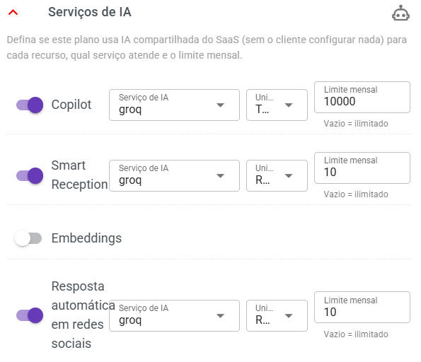
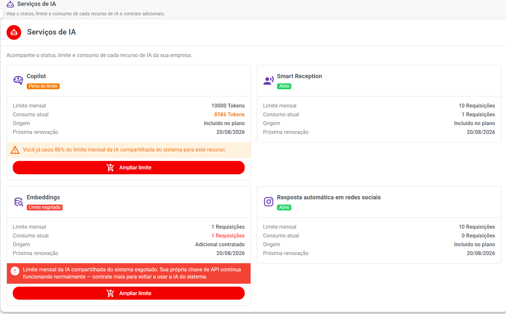

# Classificação Automática com Jev

A **Classificação Automática** usa a inteligência artificial **SystemOne (modelo Jev)** para organizar os atendimentos da conversa **sem que ninguém precise fazer nada**.

O mais importante para entender o Jev:

> 💡 **O Jev não conversa com o cliente e não escreve mensagens.** Ele lê a conversa e **responde perguntas sobre ela**: "qual etiqueta combina?", "o cliente está interessado em comprar?", "qual etapa do funil?". Com as respostas em mãos, o sistema aplica sozinho as ações liberadas.

Isso é diferente de um chatbot: o chatbot **escreve** para o cliente. O Jev **decide** — e o sistema executa a decisão.

***

## ✅ O que a IA pode fazer sozinha

Cada ação abaixo pode ser **ligada ou desligada**. O que estiver liberado, a IA faz automaticamente:

| Ação | O que ela faz |
| --- | --- |
| 🏷️ **Etiqueta automática** | Aplica no contato a etiqueta que combina com o assunto da conversa. Como fica no contato, vale para todos os atendimentos dele. |
| 🔥 **Interesse do cliente (lead)** | Marca o quanto o cliente parece interessado em comprar, do mais frio ao mais quente. |
| 🗂️ **Kanban** | Move o atendimento para a etapa do funil que corresponde ao ponto da conversa. |
| 👤 **Encaminhar para humano** | Quando a conversa precisa de uma pessoa, a IA para de responder e deixa o atendimento para a equipe. |
| 📥 **Direcionar fila** | Atendimento que chega sem fila, sem bot e sem automação é lido pela IA e movido para a fila mais adequada. |
| 😠 **Detectar insatisfação** | Percebe cliente insatisfeito, identifica o motivo (demora, cobrança, risco de cancelamento), aplica a etiqueta e encaminha para um atendente, avisando os supervisores. |
| ⏰ **Follow-up inteligente** | Antes de insistir com quem não responde, a IA decide: enviar a próxima tentativa, adiar para depois ou encerrar sem incomodar o cliente. |

> 💡 As três primeiras ações (etiqueta, lead e kanban) ficam registradas também no **contato**, então a equipe já enxerga a conversa organizada ao abrir o próximo atendimento.

***

## 🔄 Como funciona na prática

**1. Chega a primeira mensagem do cliente** — a IA lê a conversa e organiza o atendimento: aplica a etiqueta, avalia o interesse e move para a etapa certa do funil.

**2. O sistema revisa a cada X mensagens novas do cliente** — a cada novo "bloco" de mensagens, a IA reavalia: o cliente mudou de assunto? A etiqueta ainda combina? A etapa do funil continua certa? O número X é configurado pelo SaaS (veja mais abaixo) — **quanto maior, menor o custo**.

**3. O sistema verifica a cada 5 minutos** o que existe de novo para analisar, de forma distribuída entre todas as empresas. Nada precisa ser feito à mão.

**4. Cada ação fica registrada** — a IA cria uma **anotação interna** no atendimento explicando o que fez e por quê, e o histórico completo aparece na tela do atendimento.

> ⚠️ Se o atendimento estiver em **grupo**, a IA não interfere. A classificação automática funciona apenas em conversas individuais.

***

## 🧩 O que o SaaS precisa fazer (resumo)

1. **Cadastrar o serviço de IA** que fará a classificação.
2. **Liberar no plano** (ou vender como **adicional**) as ações que os clientes poderão usar.
3. **Ajustar a configuração geral** de quantas mensagens disparam uma nova revisão.

O cliente não configura nada de técnico: ele só **liga ou desliga** as ações que o plano dele já libera.

***

## 1️⃣ Cadastrar o Serviço de IA

Acesse:

**Painel SaaS → Inteligência Artificial → Serviços de IA**

Crie (ou aproveite) um serviço e, na seção **Habilitado para**, marque a opção:

**Classificação automática**

> 💡 As seis opções da classificação (classificação, etiqueta, lead, kanban, encaminhamento para humano e direcionamento de fila) usam **o mesmo serviço de IA**. Marcar "Classificação automática" já prepara o serviço para todas elas.

Se ainda não sabe como cadastrar um serviço, consulte a página [IA Integrada](./README.md), que explica provedores, modelos, tokens e pool de tokens passo a passo.

***

## 2️⃣ Liberar no Plano

Acesse:

**Painel SaaS → Comercial → Planos**

Abra um plano e localize a seção:

**Serviços de IA**

Ali ficam os interruptores da classificação automática:

* **Classificação automática** — é o **interruptor principal**. Sem ele ligado, nenhuma das outras ações funciona, porque é ele que faz a análise da conversa.
* **Etiqueta automática**, **Interesse do lead**, **Kanban**, **Encaminhamento para humano** e **Direcionamento para fila** — são as **ações**. Elas só aparecem e só funcionam com o interruptor principal ligado.

Para cada item ligado, informe:

| Campo | O que significa |
| --- | --- |
| **Serviço de IA** | Qual serviço cadastrado será usado pela classificação. |
| **Unidade do limite** | Como medir o consumo: **Requisições** (cada análise conta 1) ou **Tokens**. |
| **Limite mensal** | Quanto cada empresa pode usar por mês. **Deixar vazio = ilimitado.** |

> 💡 **Somente o interruptor principal consome cota.** As ações individuais não têm cota própria — elas só autorizam o que a classificação pode aplicar. Por isso, ao ligar "Etiqueta automática" num plano, o consumo continua sendo medido apenas na "Classificação automática".

> ⚠️ A ação **Follow-up inteligente** segue uma regra própria: ela acompanha o recurso **Smart Reception** do plano, não a classificação. O cliente também precisa ter a classificação automática liberada, porque ela é quem faz a análise.

<figure><figcaption></figcaption></figure>

***

## 3️⃣ Vender como Adicional

Além de incluir no plano, o SaaS pode **vender a classificação automática separadamente**, para clientes que têm um plano sem esse recurso.

Acesse:

**Painel SaaS → Comercial → Adicionais**

Clique em **Criar Adicional** e preencha:

* **Nome:** Classificação automática
* **Tipo:** Classificação automática
* **Limite mensal:** quantidade de análises (ou tokens) que o adicional adiciona
* **Valor mensal:** preço cobrado
* **Serviço de IA:** o serviço cadastrado no passo 1
* **Planos disponíveis:** quais planos podem contratar

Um cliente pode ter o recurso de **três formas**, e o sistema soma os limites:

| Origem | Exemplo |
| --- | --- |
| **Plano** | Incluído no plano: 1.000 requisições/mês |
| **Adicional** | Comprou um adicional: +500 requisições/mês |
| **Plano + Adicional** | 1.000 do plano + 500 do adicional = 1.500/mês |

> 💡 Quando o plano do cliente não inclui o recurso, a tela dele mostra o aviso **"Seu plano atual não inclui a classificação automática de conversas"** com um botão para **falar com o suporte** — ou seja, a venda do adicional nasce da própria tela do cliente.

***

## 4️⃣ Configuração geral: de quanto em quanto tempo revisar

Acesse a configuração da classificação no painel SaaS:

**Classificação automática com SystemOne**

O campo principal é:

**Revisar a conversa a cada \_\_ mensagens**

* A **primeira análise acontece sempre** na primeira mensagem do cliente.
* Depois, a IA só revisa a conversa quando o cliente enviar **mais este número de mensagens novas**.
* Exemplo: com o valor **5**, o cliente manda 5 mensagens e só então a IA reavalia o atendimento.
* **Quanto maior o número, menor o custo**, porque cada revisão é uma chamada paga ao provedor de IA.

> 💡 Se o campo ficar vazio ou com valor inválido, o sistema usa um padrão seguro. Ajuste o número de acordo com o equilíbrio que quiser entre custo e atualização das etiquetas.

***

## 👤 Como o cliente usa

O cliente encontra tudo em:

**Configurações → Classificação automática**

A tela mostra:

* **Status geral** — uma etiqueta verde **Ativo** ou cinza **Inativo**, conforme o plano dele.
* **Qual IA é utilizada** — ex.: *IA utilizada: SystemOne (modelo Jev)*.
* **Um interruptor por ação** — o cliente pode **desligar** qualquer ação que o plano dele já inclui (por exemplo, não quer que a IA mova nada no kanban). O contrário não é possível: ele não consegue **ligar** nada que o plano não libera.

### 📥 Fila do atendimento humano

Quando a ação **Encaminhar para atendente humano** está ligada, aparece um campo para escolher a **fila de destino**:

* O atendimento sai da IA e vai para essa fila.
* Se nenhuma fila for escolhida, o ticket **não é alterado** (continua na IA) e os administradores são notificados.
* A opção **Manter fila atual** deixa o atendimento na fila em que já está e registra apenas o aviso.

> 💡 A opção **Detectar cliente insatisfeito** aparece junto do encaminhamento para humano, porque uma detecção de insatisfação também encaminha o atendimento para a equipe.

### ⚠️ Avisos que o cliente pode ver

* **"Seu plano atual não inclui a classificação automática"** — o plano dele não tem o recurso. Botão para falar com o suporte.
* **"Limite mensal da classificação automática esgotado. A renovação ocorre em \[data]"** — o cliente usou toda a cota do mês. Ele pode ampliar o limite contratando um adicional e a análise volta a funcionar na hora.

<figure><figcaption></figcaption></figure>

***

## 📜 Histórico de ações da IA

Dentro de cada atendimento existe o painel **"Ações automáticas da IA"**, em formato de linha do tempo. Ali a equipe enxerga tudo que a IA fez com aquele ticket, com data, hora e o motivo de cada decisão:

| Ação | Significado |
| --- | --- |
| Classificação automática | A IA analisou a conversa. |
| Etiquetas aplicadas | Etiqueta(s) colocada(s) no contato. |
| Interesse classificado | Nível de interesse (frio → quente) marcado. |
| Movido no kanban | Atendimento movido de etapa no funil. |
| Encaminhado p/ humano | A conversa saiu da IA e foi para a equipe. |
| Fila alterada | Atendimento movido para a fila escolhida pela IA. |
| Anotação interna | Explicação da decisão registrada no ticket. |

É possível **filtrar por ação** para achar rapidamente, por exemplo, só os momentos em que a IA encaminhou para um humano.

> 💡 Esse histórico é a melhor forma de responder dúvidas do tipo "por que esse atendimento foi para essa fila?" — cada entrada mostra o motivo em linguagem normal.

***

## 🛡️ Regras de segurança do funcionamento

Estes cuidados já valem por padrão, sem configuração extra:

* **Só transfere para fila com gente**: antes de mover um atendimento para uma fila, a IA verifica se existe **atendente online** nela. Se não houver, a transferência fica **guardada e é tentada de novo mais tarde** — o atendimento nunca fica "perdido" numa fila vazia.
* **Nunca pisa no atendente**: se um atendimento já ganhou fila, bot ou automação por outro caminho, a IA **não sobrescreve** essa escolha.
* **Falha do provedor não para o sistema**: se o serviço de IA estiver instável, o sistema espera e tenta de novo automaticamente, com intervalos crescentes.
* **Limite respeitado sempre**: ao esgotar a cota mensal, as análises param até a renovação — sem cobrança surpresa ao provedor.
* **Desligar nunca libera**: os interruptores do cliente só servem para **desligar** o que o plano já inclui. Ligar um recurso fora do plano continua impossível.

***

## ❓ Perguntas frequentes

#### O Jev responde as mensagens dos clientes?

**Não.** O Jev só **lê** a conversa e **decide** o que fazer (etiqueta, interesse, kanban, fila, encaminhamento). Ele nunca escreve para o cliente.

#### Preciso criar um serviço de IA novo só para a classificação?

Não. Pode ser o mesmo serviço já usado por Copilot ou Smart Reception — basta marcar **Classificação automática** em "Habilitado para".

#### Posso vender a classificação automática para quem tem plano sem ela?

Sim. Crie um **Adicional** do tipo *Classificação automática* e defina em quais planos ele aparece.

#### O cliente consegue ligar as ações que quiser?

Não. O cliente só pode **desligar** ações que o plano dele já inclui. O que é liberado é decisão do SaaS, no plano ou no adicional.

#### Como faço para gastar menos com IA?

Aumente o campo **"Revisar a conversa a cada X mensagens"** na configuração do painel SaaS e/ou defina **limites mensais** nos planos. A primeira análise de cada conversa continua acontecendo normalmente.

#### O que acontece quando o limite do cliente acaba?

As análises param até a renovação mensal. A tela do cliente mostra a data de renovação, e o cliente pode contratar um adicional para ampliar o limite.

#### Onde vejo o que a IA fez em um atendimento?

No painel **"Ações automáticas da IA"** dentro do próprio atendimento, com data, hora e motivo de cada ação.

#### A IA funciona em grupos de WhatsApp?

Não. A classificação automática só analisa conversas individuais.
