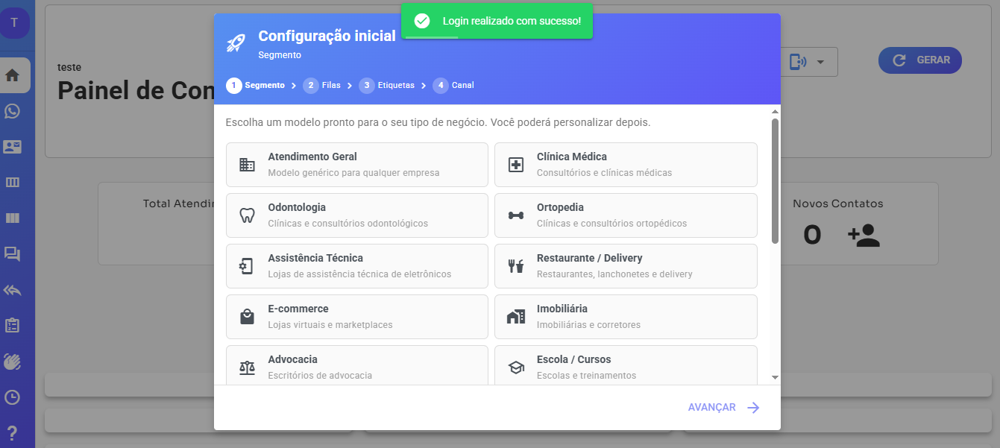
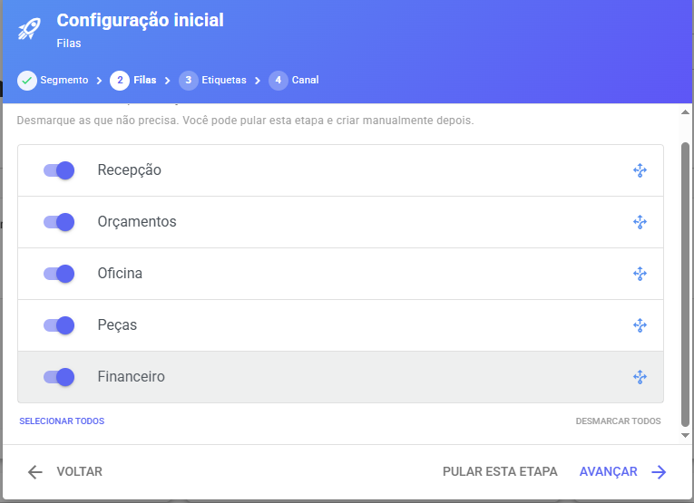
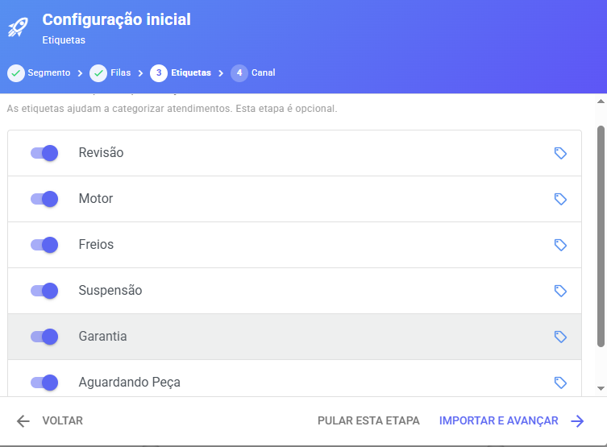
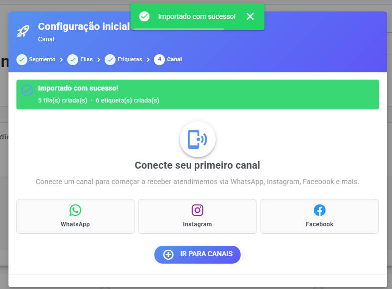
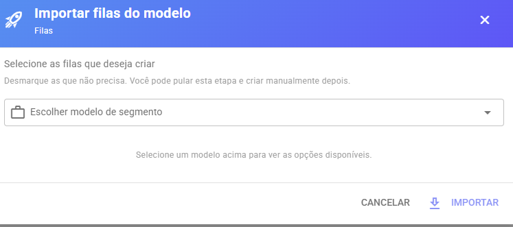
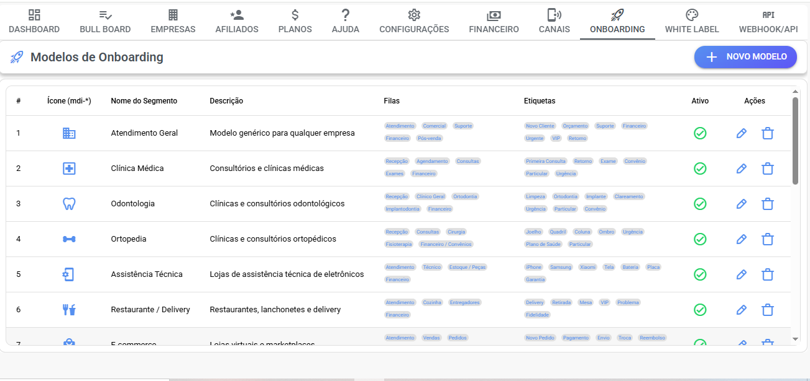
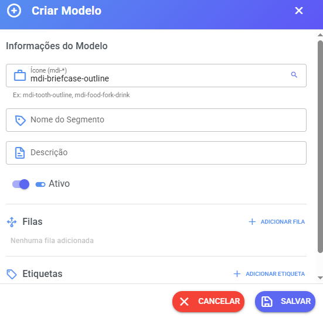

# Onboarding Inicial

O Onboarding Inicial foi criado para ajudar novos usuários a configurarem rapidamente o sistema logo após o primeiro acesso.

O objetivo é reduzir o tempo de configuração e permitir que a operação comece a funcionar em poucos minutos, utilizando modelos prontos de filas e etiquetas adaptados ao segmento da empresa.

***

## Quando o Onboarding é exibido?

Ao acessar o Dashboard, o sistema verifica se existem configurações básicas já cadastradas.

O assistente será exibido quando:

* Não existir nenhuma fila cadastrada.
* Não existir nenhum canal conectado.

Se o cliente já possuir filas cadastradas, o assistente não será exibido automaticamente.

Da mesma forma, se já existir um canal conectado, o usuário seguirá utilizando o sistema normalmente.

***

## Etapa 1 - Escolha do Segmento

<figure><figcaption></figcaption></figure>

O primeiro passo consiste em selecionar o segmento da empresa.

Exemplos:

* Clínica
* Advocacia
* Imobiliária
* Loja Virtual
* Restaurante
* Assistência Técnica
* Prestador de Serviços
* Outros

Cada segmento possui sugestões próprias de:

* Filas
* Etiquetas
* Ícone
* Nome
* Descrição

Todos os modelos são totalmente personalizáveis pelo administrador do painel SaaS.

***

## Etapa 2 - Seleção de Filas

<figure><figcaption></figcaption></figure>

Após escolher o segmento, o sistema apresenta sugestões de filas compatíveis com aquela atividade.

Exemplo para uma clínica:

* Recepção
* Agendamentos
* Financeiro
* Suporte
* Comercial

O usuário pode:

* Selecionar todas as filas.
* Selecionar apenas algumas.
* Ignorar sugestões.

As filas escolhidas serão criadas automaticamente.

### Proteção contra duplicidade

Caso uma fila com o mesmo nome já exista no sistema, ela não será criada novamente.

Isso evita registros duplicados.

***

## Etapa 3 - Seleção de Etiquetas

<figure><figcaption></figcaption></figure>

Nesta etapa são exibidas etiquetas relacionadas ao segmento escolhido.

Exemplo:

* Novo Cliente
* Orçamento
* Agendado
* Retorno
* Urgente
* Pós-venda

O usuário pode escolher quais etiquetas deseja importar.

### Proteção contra duplicidade

Caso uma etiqueta já exista com o mesmo nome, o sistema não criará uma nova etiqueta.

***

## Etapa 4 - Conectar Canal

<figure><figcaption></figcaption></figure>

Após finalizar a configuração inicial, o usuário será direcionado para a tela de canais.

O próximo passo é conectar o primeiro WhatsApp, Instagram, Facebook ou outro canal suportado.

***

## Cadastro Automático de Canal

Ao acessar a tela de canais sem nenhuma conexão cadastrada, o sistema abrirá automaticamente o modal de criação de canal.

Isso evita que o usuário precise procurar manualmente onde realizar a configuração.

O objetivo é tornar a implantação mais simples para usuários iniciantes.

***

## Fluxo Simplificado

O fluxo recomendado para novos clientes é:

1. Escolher o segmento.
2. Selecionar as filas desejadas.
3. Selecionar as etiquetas desejadas.
4. Conectar o primeiro canal.
5. Iniciar os atendimentos.

Todo o processo pode ser concluído em poucos minutos.

***

## Importação de Modelos

Além do Onboarding Inicial, os modelos também podem ser utilizados posteriormente.

### Importar Filas

<figure><figcaption></figcaption></figure>

Na tela de Filas existe a opção "Importar Modelos".

Ao utilizar essa opção serão exibidos apenas modelos de filas.

***

### Importar Etiquetas

Na tela de Etiquetas existe a opção "Importar Modelos".

Ao utilizar essa opção serão exibidos apenas modelos de etiquetas.

***

## Benefícios

* Configuração inicial mais rápida.
* Menor curva de aprendizado.
* Menos erros de configuração.
* Modelos adaptados ao segmento da empresa.
* Evita criação de registros duplicados.
* Facilita a implantação para usuários iniciantes.

## Gerenciamento de Modelos (Painel SaaS)

Os modelos utilizados pelo Onboarding são totalmente configuráveis pelo administrador do painel SaaS.

Isso permite adaptar as sugestões de filas e etiquetas para diferentes segmentos de mercado.

***

## Onde Gerenciar os Modelos

<figure><figcaption></figcaption></figure>

No painel SaaS existe uma área específica para gerenciamento dos modelos de Onboarding.

Nela é possível:

* Criar segmentos.
* Editar segmentos existentes.
* Definir ícones.
* Definir descrições.
* Configurar filas sugeridas.
* Configurar etiquetas sugeridas.
* Ativar ou desativar modelos.

***

## Criando um Segmento

<figure><figcaption></figcaption></figure>

Ao criar um novo segmento é possível definir:

#### Nome

Nome que será exibido para o cliente durante o Onboarding.

Exemplos:

* Clínica
* Imobiliária
* Restaurante
* Escritório de Advocacia
* E-commerce

#### Ícone

Ícone utilizado para facilitar a identificação visual do segmento.

#### Descrição

Breve explicação exibida ao usuário durante a seleção.

Exemplo:

"Modelos recomendados para clínicas médicas, odontológicas e profissionais da saúde."

***

## Configurando Filas

Cada segmento pode possuir diversas filas sugeridas.

Exemplo para uma imobiliária:

* Comercial
* Locação
* Vendas
* Financeiro
* Pós-venda

Essas filas serão apresentadas para seleção durante o processo de Onboarding.

O cliente poderá escolher quais deseja importar.

***

## Configurando Etiquetas

Também é possível definir etiquetas sugeridas para cada segmento.

Exemplo:

* Novo Lead
* Cliente Ativo
* Visita Agendada
* Contrato Enviado
* Contrato Assinado

As etiquetas serão exibidas na etapa de importação de etiquetas.

***

## Atualização dos Modelos

Qualquer alteração realizada nos modelos ficará disponível para novos processos de Onboarding e futuras importações de modelos.

As alterações não modificam automaticamente filas e etiquetas já existentes nos clientes.

***

## Evitando Duplicidades

Durante a importação, o sistema verifica se já existe uma fila ou etiqueta com o mesmo nome.

Se já existir:

* O registro não será criado novamente.
* Nenhuma duplicidade será gerada.

Isso garante uma importação segura mesmo quando o cliente utilizar os modelos mais de uma vez.

***

## Boas Práticas

* Utilize nomes simples e objetivos.
* Evite criar filas em excesso.
* Mantenha apenas etiquetas realmente necessárias.
* Organize os modelos por segmento de atuação.
* Revise periodicamente as sugestões oferecidas aos clientes.

Um conjunto bem configurado de modelos reduz o tempo de implantação e melhora a experiência dos novos usuários.
