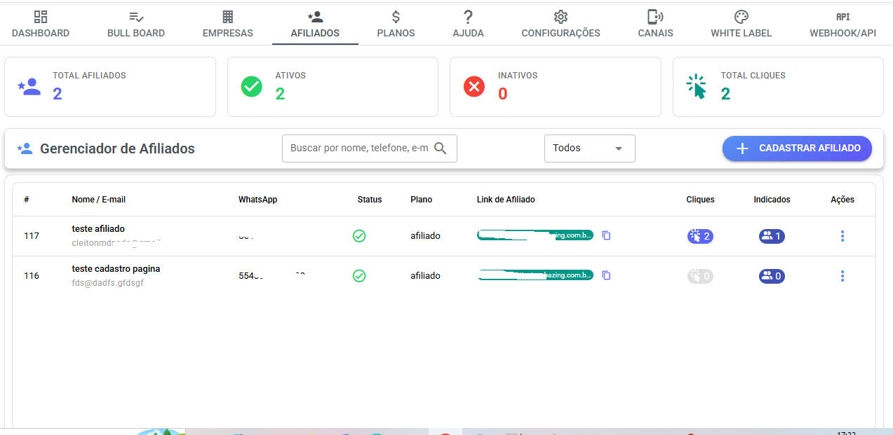
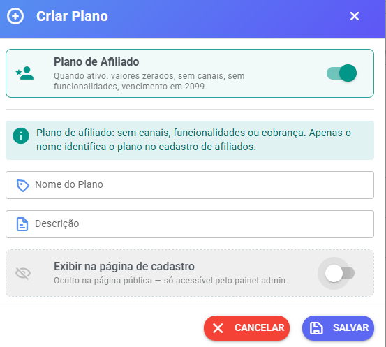
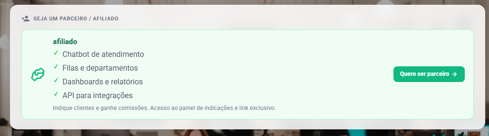

# Programa de Afiliados (Indique e Ganhe)

O sistema possui um **Programa de Afiliados**, onde seus clientes podem **indicar novos usuários** e receber **comissões pelas indicações**.

Esse sistema é conhecido como **Indique e Ganhe**.

Com ele você pode:

* incentivar clientes a divulgar sua plataforma
* acompanhar quem indicou novos usuários
* controlar pagamento de comissões

***

## 📌 Como acessar a configuração

No painel administrativo do sistema.

Caminho:

```
Painel SaaS → Configurações → Indique e Ganhe
```

<figure><figcaption></figcaption></figure>

***

## ⚙️ Configurações disponíveis

Na tela de configuração você encontrará as seguintes opções.

***

## 1️⃣ Habilitar programa de afiliados

Essa opção ativa ou desativa o sistema de indicação.

Quando **ativado**:

* seus clientes poderão indicar novos usuários
* aparecerá uma nova opção no menu chamada **Indicação**

***

## 2️⃣ Ganho por indicação

Aqui você define **quanto será pago por cada indicação convertida**.

Exemplo:

```
R$ 50,00 por cliente indicado
```

Ou outro valor que desejar.

***

## 3️⃣ Descrição do programa

Aqui você pode escrever uma **explicação do programa para os clientes**.

Esse texto aparecerá na página de indicação.

Exemplo de texto:

```
Para cada cliente que contratar o sistema através do seu link você recebe uma recompensa.
```

***

## 👥 Página de indicação para clientes

Quando o programa estiver habilitado, seus clientes verão um novo menu.

Menu:

```
Indicação
```

<figure><figcaption></figcaption></figure>

***

## 🔗 Link de indicação

Dentro dessa página o cliente verá um **link exclusivo de indicação**.

Exemplo:

```
https://seufrontend.com.br/#/indicacao/t16
```

Esse link pode ser compartilhado com outras pessoas.

<figure><figcaption></figcaption></figure>

***

## 📊 Acompanhamento das indicações

Na página de indicação o cliente pode acompanhar:

* quem ele indicou
* quem já se cadastrou
* quem está em teste
* quem virou cliente

Também poderá ver:

* comissões pendentes
* comissões pagas

<figure><figcaption></figcaption></figure>

***

## 🏢 Como o administrador acompanha indicações

O administrador do sistema pode visualizar as indicações no painel SaaS.

Caminho:

```
Painel SaaS → Empresas
```

<figure><figcaption></figcaption></figure>

***

## 📌 Coluna de indicação

Na lista de empresas existe uma coluna chamada:

```
Indicação
```

Essa coluna mostra:

* quem indicou o cliente
* código ou nome do indicador

<figure><figcaption></figcaption></figure>

***

## 💵 Marcar comissão como paga

Quando a comissão for paga ao afiliado, o administrador pode registrar isso.

Basta:

1. clicar na informação de indicação
2. marcar como **comissão paga**

Isso atualizará automaticamente no painel do cliente.

***

## 🔗 Criar links personalizados de indicação

Você também pode criar **links personalizados para pessoas que não fazem parte da plataforma**.

Exemplo:

```
https://seufrontend.com.br/#/indicacao/cleitonmeurer
```

Assim o sistema registrará que o cadastro veio dessa indicação.

***

## ⚠️ Regra importante sobre códigos

Evite criar links personalizados que comecem com a letra **t**.

Exemplo:

```
t16
```

Esse formato já é usado pelo sistema para identificar clientes.

Exemplo:

```
https://seufrontend.com.br/#/indicacao/t16
```

Nesse caso significa:

**empresa ID 16 indicou o cliente.**

***

### 🚀 Cadastro exclusivo para afiliados

Painel SaaS conta com uma nova área chamada **Afiliados**, permitindo criar acessos exclusivos para parceiros acompanharem suas indicações de forma simples e organizada.

Nesta área é possível:

* Cadastrar afiliados
* Gerar links de indicação
* Acompanhar cliques nos links
* Visualizar cadastros realizados através das indicações

<figure><figcaption></figcaption></figure>

***

### 📝 Plano de Afiliado

No cadastro de planos agora existe a opção:

* **Plano de Afiliado**

Quando esta opção estiver ativa:

* Valores do plano ficam zerados
* Sem acesso a canais
* Sem acesso às funcionalidades do sistema
* Vencimento automático definido para o ano **2099**

Esse modelo foi criado especialmente para acessos exclusivos de afiliados acompanharem seus resultados.

####

<figure><figcaption></figcaption></figure>

***

### 🌍 Cadastro público para afiliados

Ao marcar um plano como **Público**, será exibido automaticamente um card na página de cadastro do sistema indicando este tipo de acesso para afiliados.

Isso facilita o auto cadastro de parceiros diretamente pela página pública.

####

<figure><figcaption></figcaption></figure>

***

## ✔️ Resumo do funcionamento

1️⃣ Administrador ativa o programa\
2️⃣ Clientes recebem link de indicação\
3️⃣ Novos usuários se cadastram pelo link\
4️⃣ O sistema registra a indicação\
5️⃣ O administrador acompanha no painel\
6️⃣ Comissão pode ser marcada como paga

***

## 🎯 Benefícios do programa de afiliados

* aumenta o crescimento da plataforma
* incentiva clientes a divulgar
* gera novas vendas automaticamente

***

💡 **Dica:**\
Compartilhe o programa de afiliados com seus clientes para aumentar o número de indicações.
