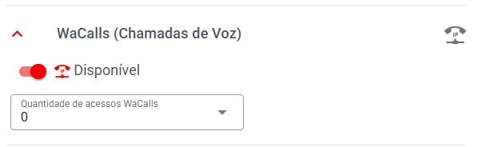
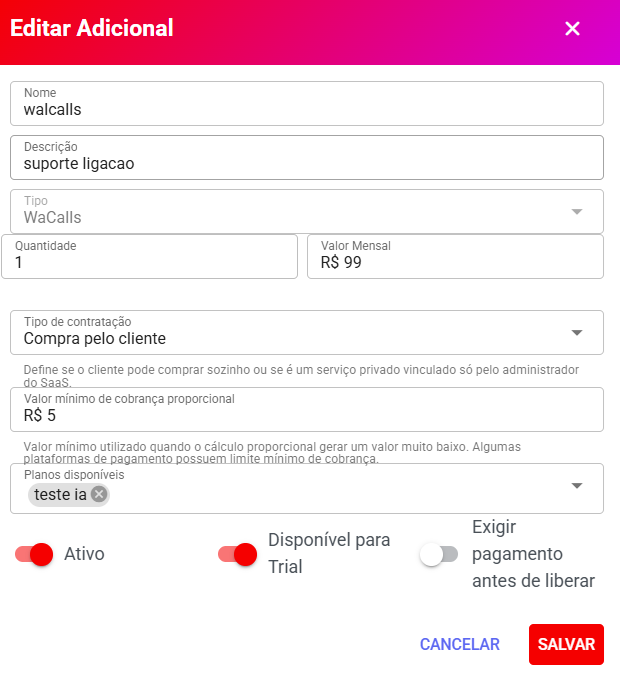
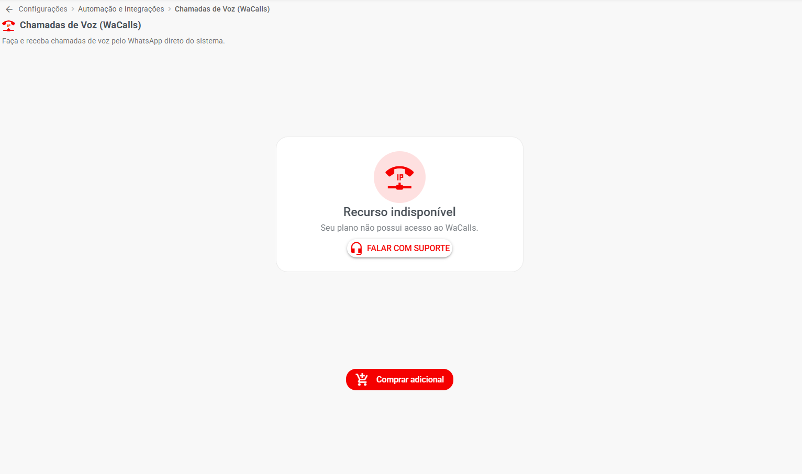
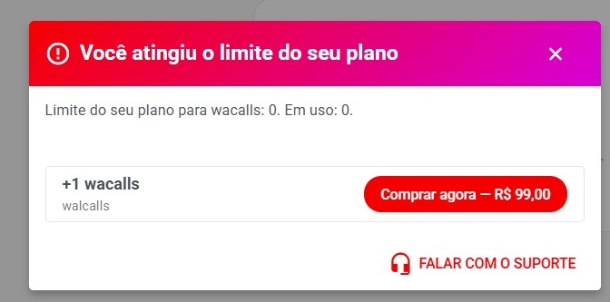
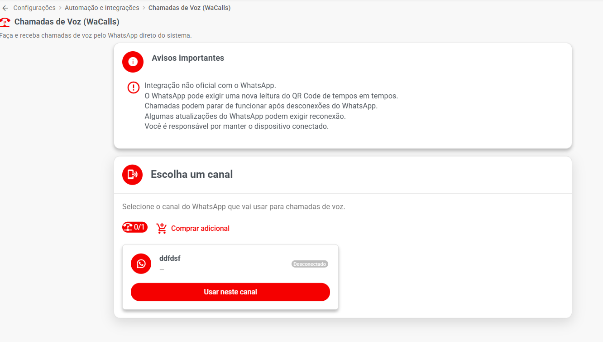
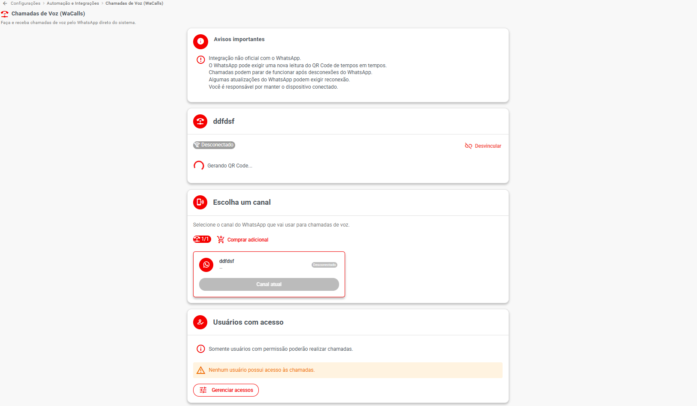

# 📞 WaCalls — Ativação Automática e Venda de Adicionais

> **Disponível a partir da versão 3.0**

A partir da versão **3.0**, o Whazing permite disponibilizar o **WaCalls** como um serviço adicional para os clientes.

Com essa funcionalidade, o cliente pode:

* Comprar o WaCalls sozinho.
* Ativar o serviço sem precisar entrar em contato com o suporte.
* Vincular automaticamente o WaCalls ao seu WhatsApp.
* Utilizar chamadas de voz.
* Ter o serviço liberado automaticamente após a contratação, conforme a configuração do SaaS.

Isso permite que o administrador do SaaS transforme o **WaCalls em uma fonte de receita adicional**.

***

## 🎯 Como funciona

O administrador do SaaS configura o WaCalls **uma única vez**.

Depois, disponibiliza o serviço nos planos e cria um adicional para venda.

O cliente poderá contratar o serviço diretamente pelo sistema.

O fluxo fica:

```
Administrador instala WaCalls
          ↓
Configura integração no SaaS
          ↓
Disponibiliza nos planos
          ↓
Cria adicional WaCalls
          ↓
Cliente acessa "Chamadas de Voz"
          ↓
Cliente compra o adicional
          ↓
Sistema libera automaticamente
          ↓
WaCalls é vinculado ao WhatsApp
          ↓
Cliente pode utilizar chamadas
```

> 💡 A principal vantagem é que o processo não depende de atendimento manual do suporte.

***

## 🛠️ 1. Instalar o WaCalls

Antes de configurar a venda automática, o **WaCalls precisa estar instalado e funcionando**.

Para isso, siga o tutorial oficial de instalação:

[Tutorial de instalação do WaCalls](https://doc.whazing.com.br/integracoes/telefonia/wacalls?utm_source=chatgpt.com)

Siga todo o procedimento de instalação e deixe o servidor WaCalls funcionando.

***

## ⚙️ 2. Configurar o WaCalls no Painel SaaS

Depois que o WaCalls estiver instalado, acesse:

**Painel SaaS → Integrações → WaCalls**

Você encontrará a configuração:

#### WaCalls

> Configure chamadas de voz WhatsApp via WaCalls.

***

## 🌐 3. URL do Servidor WaCalls

Informe o endereço público do servidor WaCalls.

Exemplo:

```
https://call.seusite.com.br/
```

Essa URL deve apontar para o servidor onde o WaCalls está instalado.


***

## 🔑 4. X-API-Key WaCalls

Informe a chave utilizada para autenticar as chamadas da API do WaCalls.

O campo aparece como:

**X-API-Key WaCalls**

Descrição:

> Chave de autenticação da API WaCalls.

Exemplo:

```
SUA_CHAVE_API
```

***

## ✅ 5. Ativar a integração

Depois de preencher:

* URL do Servidor WaCalls
* X-API-Key

ative:

**Integração ativa**

Essa opção permite que o SaaS utilize o WaCalls.

A própria tela informa:

> Quando desativado, nenhum cliente tenta conectar ao WaCalls, mesmo com URL e chave preenchidas.

Portanto, para disponibilizar o serviço:

**Integração ativa → Ativado**

***

## 📦 6. Disponibilizar WaCalls nos planos

Depois de configurar a integração, precisamos informar quais planos podem utilizar o WaCalls.

Acesse:

**Painel SaaS → Comercial → Planos**

Abra o plano desejado.

Localize:

### WaCalls (Chamadas de Voz)

Ative:

**Disponível**

Depois existe o campo:

#### Quantidade de acessos WaCalls

Informe a quantidade de acessos incluídos no plano.

Exemplo:

```
1
```

Isso significa que o plano inclui um acesso WaCalls.

***

## 💡 7. Deixar quantidade 0 para vender como adicional

Existe uma estratégia interessante:

```
Quantidade de acessos WaCalls: 0
```

Nesse caso, o plano pode ficar preparado para o recurso, mas o acesso será adquirido através do **adicional WaCalls**.

Essa configuração é especialmente útil para SaaS que deseja:

> **Vender o WaCalls separadamente.**

#### Exemplo

Plano:

**Premium**

WaCalls:

**Disponível**

Quantidade:

**0**

Depois o cliente compra:

**+1 WaCalls**

<figure><figcaption></figcaption></figure>

***

## 💰 8. Criar o adicional WaCalls

Agora vamos criar o produto que o cliente poderá comprar.

Acesse:

**Painel SaaS → Comercial → Adicionais**

Clique em:

**Criar Adicional**

ou edite um adicional existente.

***

## 📝 9. Preencher o adicional

Exemplo:

#### Nome

```
WaCalls
```

#### Descrição

```
Suporte a ligações de voz pelo WhatsApp.
```

#### Tipo

Selecione:

**WaCalls**

#### Quantidade

```
1
```

#### Valor mensal

Exemplo:

```
R$ 99,00
```

> 💡 O valor é apenas um exemplo. Defina o preço conforme seus custos e sua estratégia comercial.

***

## 🛒 10. Tipo de contratação

Selecione:

**Compra pelo cliente**

Essa opção é muito importante.

Ela permite que o próprio cliente contrate o WaCalls sem precisar solicitar a ativação ao suporte.

A descrição do sistema explica:

> Define se o cliente pode comprar sozinho ou se é um serviço privado vinculado só pelo administrador do SaaS.

Para venda automática:

**Compra pelo cliente → Ativado**

***

## 💵 11. Valor mínimo de cobrança proporcional

Informe o valor mínimo utilizado quando o cálculo proporcional resultar em um valor muito baixo.

Exemplo:

```
R$ 5,00
```

Esse valor pode ser importante porque algumas plataformas de pagamento possuem um valor mínimo permitido para cobrança.

***

## 📋 12. Selecionar os planos disponíveis

Na área:

**Planos disponíveis**

selecione os planos que poderão comprar o WaCalls.

Exemplo:

```
✓ Plano Premium
✓ Plano Empresarial
```

Dessa forma, o adicional não será disponibilizado para planos que não possuem autorização.

***

## ⚙️ 13. Outras opções

Configure também:

#### Ativo

Deixe ativado para disponibilizar o adicional.

#### Disponível para Trial

Ative somente se quiser permitir que o WaCalls seja utilizado durante o período de teste.

#### Exigir pagamento antes de liberar

Quando ativado, o sistema exige a confirmação do pagamento antes de liberar o adicional.

> 💡 Para serviços pagos, essa opção pode ser interessante para evitar liberar o recurso antes da confirmação do pagamento.

<figure><figcaption></figcaption></figure>

***

## 👤 14. Agora o cliente pode contratar

Depois que tudo estiver configurado, o cliente acessará:

**Automação e Integrações → Chamadas de Voz (WaCalls)**

Essa tela apresenta o serviço de chamadas de voz.

O cliente poderá verificar a disponibilidade e realizar a contratação.

***

## 🛒 15. Compra feita pelo próprio cliente

O cliente não precisa abrir chamado.

O fluxo será:

**Automação e Integrações**

→ **Chamadas de Voz (WaCalls)**

→ **Contratar**

→ **Pagamento**

→ **Confirmação**

→ **Ativação automática**

***

## 🔄 16. Vinculação automática

Depois da contratação e liberação do adicional, o sistema realiza automaticamente o processo necessário para vincular o WaCalls ao WhatsApp do cliente.

O cliente não precisa:

* Enviar mensagem para o suporte.
* Informar manualmente os dados ao administrador.
* Solicitar ativação por chamado.
* Realizar configurações técnicas no servidor.

A ideia é que todo o processo seja realizado automaticamente pelo sistema.

***

## 📞 17. Utilização do WaCalls

Depois da ativação, o cliente poderá utilizar os recursos de chamadas de voz disponibilizados pelo WaCalls.

O cliente encontra o recurso em:

**Automação e Integrações → Chamadas de Voz (WaCalls)**

***

## 💳 18. Como funciona a cobrança

O WaCalls pode funcionar como um **adicional mensal**.

Exemplo:

```
Plano:
Premium

WaCalls:
Não incluído

Adicional contratado:
+1 WaCalls

Valor:
R$ 99,00/mês
```

O adicional permanece associado à empresa enquanto estiver ativo.

***

## 📅 19. Contratação no meio do ciclo

Se o cliente contratar o WaCalls no meio do período de cobrança, o sistema pode utilizar o cálculo proporcional configurado para os adicionais.

Exemplo:

**Valor mensal: R$ 99,00**

O cliente contrata próximo do vencimento.

O sistema calcula o valor correspondente ao período restante, respeitando o **valor mínimo proporcional** configurado.

***

## 🔒 20. Pagamento antes da liberação

Se a opção:

**Exigir pagamento antes de liberar**

estiver ativada, o sistema aguarda a confirmação do pagamento antes de liberar o serviço.

Isso ajuda a evitar:

> Cliente recebe o serviço → não paga → serviço fica liberado.

Com a opção ativada:

```
Cliente solicita
      ↓
Pagamento
      ↓
Pagamento confirmado
      ↓
Adicional liberado
      ↓
WaCalls ativado
```

***

## 🎯 21. Exemplo completo

Imagine que você tenha:

#### Plano Premium

```
WaCalls:
Disponível ✓

Quantidade:
0
```

Isso significa que o recurso está disponível para o plano, mas não existe nenhum acesso incluído gratuitamente.

Depois você cria:

#### Adicional WaCalls

```
Nome:
WaCalls

Tipo:
WaCalls

Quantidade:
1

Valor:
R$ 99,00/mês

Compra pelo cliente:
✓

Plano:
Premium

Ativo:
✓
```

O cliente entra em:

**Automação e Integrações → Chamadas de Voz (WaCalls)**

Compra o adicional.

Depois da confirmação:

```
Adicional contratado
        ↓
+1 WaCalls
        ↓
Ativação automática
        ↓
Vinculação ao WhatsApp
        ↓
Chamadas disponíveis
```

***

## 🚀 22. Modelo de venda recomendado

Uma estratégia simples para SaaS é:

#### Plano gratuito

WaCalls:

**Não disponível**

***

#### Plano inicial

WaCalls:

**Disponível**

Quantidade:

**0**

Cliente compra se desejar.

***

#### Plano Premium

WaCalls:

**Disponível**

Quantidade:

**0**

Cliente compra separadamente.

***

#### Plano Empresarial

Você pode decidir entre:

**Opção A**

Incluir 1 WaCalls gratuitamente.

ou:

**Opção B**

Deixar 0 e vender como adicional.

***

## 💡 23. Vantagem da venda como adicional

A principal vantagem é que o cliente não precisa mudar de plano para utilizar chamadas.

Por exemplo:

```
Cliente possui Plano Premium
          ↓
Precisa de chamadas
          ↓
Compra WaCalls
          ↓
+1 acesso
          ↓
R$ 99/mês
```

Isso cria uma nova possibilidade de receita recorrente para o SaaS.

***

## 📊 24. Por que automatizar?

Sem ativação automática, o fluxo poderia ser:

```
Cliente quer WaCalls
        ↓
Abre chamado
        ↓
Suporte verifica pagamento
        ↓
Administrador configura
        ↓
Suporte responde
        ↓
Cliente começa a usar
```

Com a ativação automática:

```
Cliente quer WaCalls
        ↓
Contrata
        ↓
Pagamento confirmado
        ↓
Sistema ativa
        ↓
Cliente utiliza
```

Isso reduz o trabalho do suporte e permite vender o serviço **24 horas por dia**.

***

<figure><figcaption></figcaption></figure>

<figure><figcaption></figcaption></figure>

<figure><figcaption></figcaption></figure>

<figure><figcaption></figcaption></figure>

<figure><figcaption></figcaption></figure>

***

## ❓ Perguntas frequentes

#### Preciso instalar o WaCalls antes?

Sim. O servidor WaCalls precisa estar instalado e funcionando antes de configurar a integração no SaaS.

#### O cliente precisa falar com o suporte para ativar?

**Não.** Quando o adicional e a integração estiverem corretamente configurados, o processo é automático.

#### Posso cobrar pelo WaCalls?

Sim. O WaCalls pode ser vendido como um **adicional mensal**.

#### Posso colocar WaCalls dentro do plano?

Sim. Você pode definir uma quantidade de acessos diretamente no plano.

#### Posso deixar a quantidade do plano em 0?

Sim. Essa é uma opção interessante quando você deseja disponibilizar o recurso para o plano, mas vender o acesso através de adicional.

#### O cliente pode comprar sozinho?

Sim. Configure o adicional como:

**Tipo de contratação → Compra pelo cliente**

#### Posso exigir pagamento antes de ativar?

Sim. Utilize:

**Exigir pagamento antes de liberar**

#### Posso liberar WaCalls somente para determinados planos?

Sim. Tanto a disponibilidade no plano quanto os **Planos disponíveis** do adicional podem ser configurados.

#### O adicional pode ser cobrado proporcionalmente?

Sim. O sistema possui cálculo proporcional para adicionais e permite definir um **valor mínimo de cobrança proporcional**.

***

## ✅ Checklist final

Antes de divulgar o WaCalls para seus clientes, confira:

* [ ] WaCalls instalado e funcionando
* [ ] URL pública funcionando
* [ ] X-API-Key configurada
* [ ] Integração WaCalls ativada
* [ ] Plano possui WaCalls disponível
* [ ] Quantidade do plano configurada
* [ ] Adicional WaCalls criado
* [ ] Tipo definido como **WaCalls**
* [ ] Quantidade definida
* [ ] Valor mensal definido
* [ ] **Compra pelo cliente** ativada
* [ ] Planos disponíveis selecionados
* [ ] Adicional ativo
* [ ] Pagamento antes de liberar configurado conforme sua estratégia
* [ ] Teste de contratação realizado
* [ ] Teste de ativação automática realizado
* [ ] Teste de vinculação ao WhatsApp realizado

> 🎉 **Pronto!** Com essa configuração, o WaCalls deixa de ser apenas uma integração técnica e passa a ser um **serviço comercial que o cliente pode contratar sozinho**, com ativação automática e cobrança recorrente.
