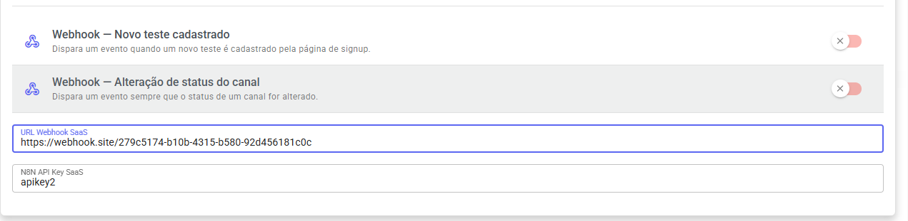

# Webhook SaaS

### 📡 Webhook/API

O painel SaaS possui integração via webhook para envio automático de eventos.

#### ⚙️ Como configurar

1. Acesse o painel SaaS
2. Vá até **Webhook/API**
3. Informe a URL do seu webhook (endpoint que irá receber os dados)

<figure><figcaption></figcaption></figure>

***

## 📡 Eventos disponíveis

Atualmente, o sistema possui os seguintes eventos:

### ✅ Novo cliente de teste cadastrado

Disparado quando um cadastro é feito pela página de teste (teste aberto).

#### 📦 Exemplo de Payload

```json
{
  "name": "Nome do cliente",
  "email": "email@exemplo.com",
  "tenantName": "Nome da empresa",
  "phone": "559999999999",
  "plano": "Plano escolhido",
  "referralId": "ID de indicação",
  "dueDate": "2026-04-10",
  "recurrence": "monthly",
  "newTenantTest": true
}
```

#### 🧠 Observações

* O campo `newTenantTest: true` identifica que é um cadastro de teste
* O webhook será enviado automaticamente após o cadastro
* Certifique-se que sua URL aceita requisições `POST` em JSON

***

## 🔄 Evento de mudança de status de canal

Disparado automaticamente quando um canal sofre alteração de status no painel SaaS.

Exemplos:

* Canal conectado
* Canal desconectado
* Reconectando
* QR Code atualizado
* Mudança de sessão

### 📦 Exemplo de Payload

```json
{
  "event": "channel.status.changed",
  "timestamp": "2026-05-21T18:20:00.000Z",
  "channel": {
    "id": 1,
    "name": "WhatsApp Suporte",
    "type": "whatsapp",
    "qrcode": "data:image/png;base64,...",
    "pairingCode": "ABCD1234",
    "number": "559999999999",
    "status": "CONNECTED",
    "previousStatus": "DISCONNECTED",
    "tenantId": 1
  },
  "company": {
    "id": 1,
    "name": "Empresa Exemplo",
    "phone": "559999999999",
    "email": "contato@empresa.com",
    "status": true
  }
}
```

### 📑 Campos do payload

#### `event`

Nome do evento disparado.

```json
"channel.status.changed"
```

#### `timestamp`

Data e horário do evento em formato ISO 8601.

#### `channel`

Objeto contendo os dados do canal.

| Campo            | Descrição               |
| ---------------- | ----------------------- |
| `id`             | ID do canal             |
| `name`           | Nome do canal           |
| `type`           | Tipo do canal           |
| `qrcode`         | QR Code atual do canal  |
| `pairingCode`    | Código de pareamento    |
| `number`         | Número conectado        |
| `status`         | Novo status do canal    |
| `previousStatus` | Status anterior         |
| `tenantId`       | ID da empresa vinculada |

#### `company`

Objeto contendo os dados da empresa vinculada ao canal.

| Campo    | Descrição           |
| -------- | ------------------- |
| `id`     | ID da empresa       |
| `name`   | Nome da empresa     |
| `phone`  | Telefone da empresa |
| `email`  | E-mail da empresa   |
| `status` | Status da empresa   |

### 🧠 Observações

* O webhook é enviado automaticamente sempre que houver alteração no status do canal
* O campo `previousStatus` permite identificar a transição de status
* Certifique-se que sua URL aceita requisições `POST` em JSON
* Recomendado responder com status HTTP `200 OK` para confirmar recebimento do webhook
